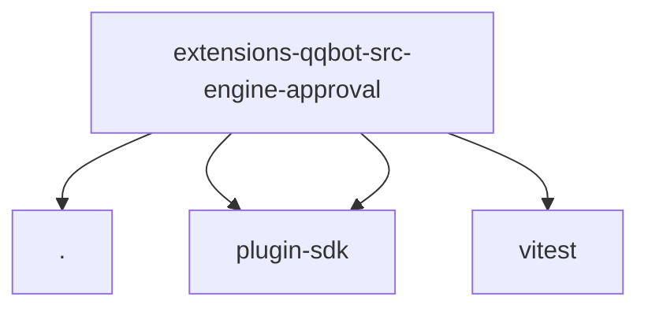

# Imports

[← Back to MODULE](MODULE.md) | [← Back to INDEX](../../INDEX.md)

## Dependency Graph

## External Dependencies

Dependencies from other modules:

- `./index.js`
- `openclaw/plugin-sdk/approval-runtime`
- `openclaw/plugin-sdk/text-utility-runtime`
- `vitest`
