# Imports

[← Back to MODULE](MODULE.md) | [← Back to INDEX](../../INDEX.md)

## Dependency Graph

```mermaid
graph TD
    extensions_qqbot_src_engine_commands_builtin[extensions-qqbot-src-engine-commands-builtin] --> messaging[messaging]
    extensions_qqbot_src_engine_commands_builtin[extensions-qqbot-src-engine-commands-builtin] --> utils[utils]
    extensions_qqbot_src_engine_commands_builtin[extensions-qqbot-src-engine-commands-builtin] --> __[..]
    extensions_qqbot_src_engine_commands_builtin[extensions-qqbot-src-engine-commands-builtin] --> __[..]
    extensions_qqbot_src_engine_commands_builtin[extensions-qqbot-src-engine-commands-builtin] --> _[.]
    extensions_qqbot_src_engine_commands_builtin[extensions-qqbot-src-engine-commands-builtin] --> _[.]
    extensions_qqbot_src_engine_commands_builtin[extensions-qqbot-src-engine-commands-builtin] --> _[.]
    extensions_qqbot_src_engine_commands_builtin[extensions-qqbot-src-engine-commands-builtin] --> _[.]
    extensions_qqbot_src_engine_commands_builtin[extensions-qqbot-src-engine-commands-builtin] --> _[.]
    extensions_qqbot_src_engine_commands_builtin[extensions-qqbot-src-engine-commands-builtin] --> _[.]
    extensions_qqbot_src_engine_commands_builtin[extensions-qqbot-src-engine-commands-builtin] --> _[.]
    extensions_qqbot_src_engine_commands_builtin[extensions-qqbot-src-engine-commands-builtin] --> _[.]
    extensions_qqbot_src_engine_commands_builtin[extensions-qqbot-src-engine-commands-builtin] --> node_fs[node:fs]
    extensions_qqbot_src_engine_commands_builtin[extensions-qqbot-src-engine-commands-builtin] --> node_os[node:os]
    extensions_qqbot_src_engine_commands_builtin[extensions-qqbot-src-engine-commands-builtin] --> node_path[node:path]
    extensions_qqbot_src_engine_commands_builtin[extensions-qqbot-src-engine-commands-builtin] --> plugin_sdk[plugin-sdk]
    extensions_qqbot_src_engine_commands_builtin[extensions-qqbot-src-engine-commands-builtin] --> plugin_sdk[plugin-sdk]
    extensions_qqbot_src_engine_commands_builtin[extensions-qqbot-src-engine-commands-builtin] --> plugin_sdk[plugin-sdk]
    extensions_qqbot_src_engine_commands_builtin[extensions-qqbot-src-engine-commands-builtin] --> plugin_sdk[plugin-sdk]
    extensions_qqbot_src_engine_commands_builtin[extensions-qqbot-src-engine-commands-builtin] --> vitest[vitest]
```

## External Dependencies

Dependencies from other modules:

- `../../messaging/sender.js`
- `../../utils/platform.js`
- `../slash-command-handler.js`
- `../slash-command-test-support.js`
- `./log-helpers.js`
- `./register-approve.js`
- `./register-basic.js`
- `./register-clear-storage.js`
- `./register-group-allways.js`
- `./register-logs.js`
- `./register-streaming.js`
- `./state.js`
- `node:fs`
- `node:os`
- `node:path`
- `openclaw/plugin-sdk/json-store`
- `openclaw/plugin-sdk/number-runtime`
- `openclaw/plugin-sdk/runtime-config-snapshot`
- `openclaw/plugin-sdk/string-coerce-runtime`
- `vitest`
