# Imports

[← Back to MODULE](MODULE.md) | [← Back to INDEX](../../INDEX.md)

## Dependency Graph

```mermaid
graph TD
    extensions_qqbot_src_engine_commands[extensions-qqbot-src-engine-commands] --> access[access]
    extensions_qqbot_src_engine_commands[extensions-qqbot-src-engine-commands] --> config[config]
    extensions_qqbot_src_engine_commands[extensions-qqbot-src-engine-commands] --> gateway[gateway]
    extensions_qqbot_src_engine_commands[extensions-qqbot-src-engine-commands] --> messaging[messaging]
    extensions_qqbot_src_engine_commands[extensions-qqbot-src-engine-commands] --> messaging[messaging]
    extensions_qqbot_src_engine_commands[extensions-qqbot-src-engine-commands] --> utils[utils]
    extensions_qqbot_src_engine_commands[extensions-qqbot-src-engine-commands] --> builtin[builtin]
    extensions_qqbot_src_engine_commands[extensions-qqbot-src-engine-commands] --> builtin[builtin]
    extensions_qqbot_src_engine_commands[extensions-qqbot-src-engine-commands] --> _[.]
    extensions_qqbot_src_engine_commands[extensions-qqbot-src-engine-commands] --> _[.]
    extensions_qqbot_src_engine_commands[extensions-qqbot-src-engine-commands] --> _[.]
    extensions_qqbot_src_engine_commands[extensions-qqbot-src-engine-commands] --> _[.]
    extensions_qqbot_src_engine_commands[extensions-qqbot-src-engine-commands] --> _[.]
    extensions_qqbot_src_engine_commands[extensions-qqbot-src-engine-commands] --> _[.]
    extensions_qqbot_src_engine_commands[extensions-qqbot-src-engine-commands] --> node_fs[node:fs]
    extensions_qqbot_src_engine_commands[extensions-qqbot-src-engine-commands] --> node_os[node:os]
    extensions_qqbot_src_engine_commands[extensions-qqbot-src-engine-commands] --> node_path[node:path]
    extensions_qqbot_src_engine_commands[extensions-qqbot-src-engine-commands] --> plugin_sdk[plugin-sdk]
    extensions_qqbot_src_engine_commands[extensions-qqbot-src-engine-commands] --> plugin_sdk[plugin-sdk]
    extensions_qqbot_src_engine_commands[extensions-qqbot-src-engine-commands] --> vitest[vitest]
```

## External Dependencies

Dependencies from other modules:

- `../access/index.js`
- `../config/group.js`
- `../gateway/ingress-effects.js`
- `../messaging/outbound.js`
- `../messaging/sender.js`
- `../utils/log.js`
- `./builtin/register-all.js`
- `./builtin/state.js`
- `./command-visibility.js`
- `./slash-command-auth.js`
- `./slash-command-handler.js`
- `./slash-command-test-support.js`
- `./slash-commands-impl.js`
- `./slash-commands.js`
- `node:fs`
- `node:os`
- `node:path`
- `openclaw/plugin-sdk/plugin-state-test-runtime`
- `openclaw/plugin-sdk/text-utility-runtime`
- `vitest`
