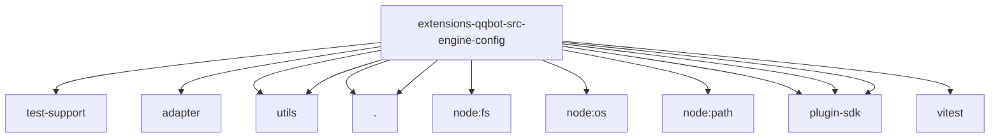

# Imports

[← Back to MODULE](MODULE.md) | [← Back to INDEX](../../INDEX.md)

## Dependency Graph

## External Dependencies

Dependencies from other modules:

- `../../test-support/runtime.js`
- `../adapter/index.js`
- `../utils/sqlite-state.js`
- `../utils/string-normalize.js`
- `./group.js`
- `./resolve.js`
- `node:fs`
- `node:os`
- `node:path`
- `openclaw/plugin-sdk/channel-policy`
- `openclaw/plugin-sdk/plugin-state-test-runtime`
- `openclaw/plugin-sdk/string-coerce-runtime`
- `vitest`
