# Imports

[← Back to MODULE](MODULE.md) | [← Back to INDEX](../../INDEX.md)

## Dependency Graph

```mermaid
graph TD
    extensions_qqbot_src_engine_gateway_stages[extensions-qqbot-src-engine-gateway-stages] --> commands[commands]
    extensions_qqbot_src_engine_gateway_stages[extensions-qqbot-src-engine-gateway-stages] --> config[config]
    extensions_qqbot_src_engine_gateway_stages[extensions-qqbot-src-engine-gateway-stages] --> group[group]
    extensions_qqbot_src_engine_gateway_stages[extensions-qqbot-src-engine-gateway-stages] --> group[group]
    extensions_qqbot_src_engine_gateway_stages[extensions-qqbot-src-engine-gateway-stages] --> group[group]
    extensions_qqbot_src_engine_gateway_stages[extensions-qqbot-src-engine-gateway-stages] --> group[group]
    extensions_qqbot_src_engine_gateway_stages[extensions-qqbot-src-engine-gateway-stages] --> ref[ref]
    extensions_qqbot_src_engine_gateway_stages[extensions-qqbot-src-engine-gateway-stages] --> ref[ref]
    extensions_qqbot_src_engine_gateway_stages[extensions-qqbot-src-engine-gateway-stages] --> utils[utils]
    extensions_qqbot_src_engine_gateway_stages[extensions-qqbot-src-engine-gateway-stages] --> utils[utils]
    extensions_qqbot_src_engine_gateway_stages[extensions-qqbot-src-engine-gateway-stages] --> __[..]
    extensions_qqbot_src_engine_gateway_stages[extensions-qqbot-src-engine-gateway-stages] --> __[..]
    extensions_qqbot_src_engine_gateway_stages[extensions-qqbot-src-engine-gateway-stages] --> _[.]
    extensions_qqbot_src_engine_gateway_stages[extensions-qqbot-src-engine-gateway-stages] --> _[.]
    extensions_qqbot_src_engine_gateway_stages[extensions-qqbot-src-engine-gateway-stages] --> _[.]
    extensions_qqbot_src_engine_gateway_stages[extensions-qqbot-src-engine-gateway-stages] --> _[.]
    extensions_qqbot_src_engine_gateway_stages[extensions-qqbot-src-engine-gateway-stages] --> _[.]
    extensions_qqbot_src_engine_gateway_stages[extensions-qqbot-src-engine-gateway-stages] --> plugin_sdk[plugin-sdk]
    extensions_qqbot_src_engine_gateway_stages[extensions-qqbot-src-engine-gateway-stages] --> plugin_sdk[plugin-sdk]
    extensions_qqbot_src_engine_gateway_stages[extensions-qqbot-src-engine-gateway-stages] --> plugin_sdk[plugin-sdk]
    extensions_qqbot_src_engine_gateway_stages[extensions-qqbot-src-engine-gateway-stages] --> plugin_sdk[plugin-sdk]
    extensions_qqbot_src_engine_gateway_stages[extensions-qqbot-src-engine-gateway-stages] --> vitest[vitest]
```

## External Dependencies

Dependencies from other modules:

- `../../commands/command-visibility.js`
- `../../config/group.js`
- `../../group/activation.js`
- `../../group/history.js`
- `../../group/mention.js`
- `../../group/message-gating.js`
- `../../ref/format-message-ref.js`
- `../../ref/store.js`
- `../../utils/text-parsing.js`
- `../../utils/voice-text.js`
- `../inbound-attachments.js`
- `../message-queue.js`
- `./access-stage.js`
- `./content-stage.js`
- `./envelope-stage.js`
- `./group-gate-stage.js`
- `./stub-contexts.js`
- `openclaw/plugin-sdk/channel-inbound`
- `openclaw/plugin-sdk/expect-runtime`
- `openclaw/plugin-sdk/string-coerce-runtime`
- `openclaw/plugin-sdk/text-utility-runtime`
- `vitest`
