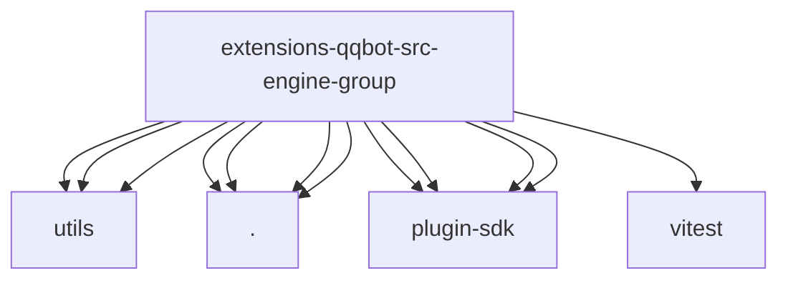

# Imports

[← Back to MODULE](MODULE.md) | [← Back to INDEX](../../INDEX.md)

## Dependency Graph

## External Dependencies

Dependencies from other modules:

- `../utils/attachment-tags.js`
- `../utils/log.js`
- `../utils/text-parsing.js`
- `./activation.js`
- `./history.js`
- `./mention.js`
- `./message-gating.js`
- `openclaw/plugin-sdk/channel-mention-gating`
- `openclaw/plugin-sdk/group-activation`
- `openclaw/plugin-sdk/security-runtime`
- `openclaw/plugin-sdk/session-store-runtime`
- `vitest`
