# Imports

[← Back to MODULE](MODULE.md) | [← Back to INDEX](../../INDEX.md)

## Dependency Graph

```mermaid
graph TD
    extensions_qqbot_src_engine_messaging[extensions-qqbot-src-engine-messaging] --> api[api]
    extensions_qqbot_src_engine_messaging[extensions-qqbot-src-engine-messaging] --> api[api]
    extensions_qqbot_src_engine_messaging[extensions-qqbot-src-engine-messaging] --> api[api]
    extensions_qqbot_src_engine_messaging[extensions-qqbot-src-engine-messaging] --> api[api]
    extensions_qqbot_src_engine_messaging[extensions-qqbot-src-engine-messaging] --> api[api]
    extensions_qqbot_src_engine_messaging[extensions-qqbot-src-engine-messaging] --> api[api]
    extensions_qqbot_src_engine_messaging[extensions-qqbot-src-engine-messaging] --> api[api]
    extensions_qqbot_src_engine_messaging[extensions-qqbot-src-engine-messaging] --> __[..]
    extensions_qqbot_src_engine_messaging[extensions-qqbot-src-engine-messaging] --> utils[utils]
    extensions_qqbot_src_engine_messaging[extensions-qqbot-src-engine-messaging] --> utils[utils]
    extensions_qqbot_src_engine_messaging[extensions-qqbot-src-engine-messaging] --> utils[utils]
    extensions_qqbot_src_engine_messaging[extensions-qqbot-src-engine-messaging] --> utils[utils]
    extensions_qqbot_src_engine_messaging[extensions-qqbot-src-engine-messaging] --> utils[utils]
    extensions_qqbot_src_engine_messaging[extensions-qqbot-src-engine-messaging] --> utils[utils]
    extensions_qqbot_src_engine_messaging[extensions-qqbot-src-engine-messaging] --> utils[utils]
    extensions_qqbot_src_engine_messaging[extensions-qqbot-src-engine-messaging] --> utils[utils]
    extensions_qqbot_src_engine_messaging[extensions-qqbot-src-engine-messaging] --> utils[utils]
    extensions_qqbot_src_engine_messaging[extensions-qqbot-src-engine-messaging] --> utils[utils]
    extensions_qqbot_src_engine_messaging[extensions-qqbot-src-engine-messaging] --> _[.]
    extensions_qqbot_src_engine_messaging[extensions-qqbot-src-engine-messaging] --> _[.]
    extensions_qqbot_src_engine_messaging[extensions-qqbot-src-engine-messaging] --> _[.]
    extensions_qqbot_src_engine_messaging[extensions-qqbot-src-engine-messaging] --> _[.]
    extensions_qqbot_src_engine_messaging[extensions-qqbot-src-engine-messaging] --> _[.]
    extensions_qqbot_src_engine_messaging[extensions-qqbot-src-engine-messaging] --> _[.]
    extensions_qqbot_src_engine_messaging[extensions-qqbot-src-engine-messaging] --> _[.]
    extensions_qqbot_src_engine_messaging[extensions-qqbot-src-engine-messaging] --> _[.]
    extensions_qqbot_src_engine_messaging[extensions-qqbot-src-engine-messaging] --> _[.]
    extensions_qqbot_src_engine_messaging[extensions-qqbot-src-engine-messaging] --> _[.]
    extensions_qqbot_src_engine_messaging[extensions-qqbot-src-engine-messaging] --> _[.]
    extensions_qqbot_src_engine_messaging[extensions-qqbot-src-engine-messaging] --> _[.]
    extensions_qqbot_src_engine_messaging[extensions-qqbot-src-engine-messaging] --> _[.]
    extensions_qqbot_src_engine_messaging[extensions-qqbot-src-engine-messaging] --> _[.]
    extensions_qqbot_src_engine_messaging[extensions-qqbot-src-engine-messaging] --> _[.]
    extensions_qqbot_src_engine_messaging[extensions-qqbot-src-engine-messaging] --> _[.]
    extensions_qqbot_src_engine_messaging[extensions-qqbot-src-engine-messaging] --> _[.]
    extensions_qqbot_src_engine_messaging[extensions-qqbot-src-engine-messaging] --> _[.]
    extensions_qqbot_src_engine_messaging[extensions-qqbot-src-engine-messaging] --> _[.]
    extensions_qqbot_src_engine_messaging[extensions-qqbot-src-engine-messaging] --> node_crypto[node:crypto]
    extensions_qqbot_src_engine_messaging[extensions-qqbot-src-engine-messaging] --> node_fs[node:fs]
    extensions_qqbot_src_engine_messaging[extensions-qqbot-src-engine-messaging] --> node_fs[node:fs]
    extensions_qqbot_src_engine_messaging[extensions-qqbot-src-engine-messaging] --> node_os[node:os]
    extensions_qqbot_src_engine_messaging[extensions-qqbot-src-engine-messaging] --> node_path[node:path]
    extensions_qqbot_src_engine_messaging[extensions-qqbot-src-engine-messaging] --> plugin_sdk[plugin-sdk]
    extensions_qqbot_src_engine_messaging[extensions-qqbot-src-engine-messaging] --> plugin_sdk[plugin-sdk]
    extensions_qqbot_src_engine_messaging[extensions-qqbot-src-engine-messaging] --> plugin_sdk[plugin-sdk]
    extensions_qqbot_src_engine_messaging[extensions-qqbot-src-engine-messaging] --> plugin_sdk[plugin-sdk]
    extensions_qqbot_src_engine_messaging[extensions-qqbot-src-engine-messaging] --> plugin_sdk[plugin-sdk]
    extensions_qqbot_src_engine_messaging[extensions-qqbot-src-engine-messaging] --> plugin_sdk[plugin-sdk]
    extensions_qqbot_src_engine_messaging[extensions-qqbot-src-engine-messaging] --> vitest[vitest]
```

## External Dependencies

Dependencies from other modules:

- `../api/api-client.js`
- `../api/media-chunked.js`
- `../api/media.js`
- `../api/messages.js`
- `../api/retry.js`
- `../api/routes.js`
- `../api/token.js`
- `../types.js`
- `../utils/file-utils.js`
- `../utils/format.js`
- `../utils/image-size.js`
- `../utils/log.js`
- `../utils/media-tags.js`
- `../utils/payload.js`
- `../utils/platform.js`
- `../utils/string-normalize.js`
- `../utils/text-parsing.js`
- `../utils/upload-cache.js`
- `./decode-media-path.js`
- `./markdown-table-chunking.js`
- `./media-source.js`
- `./media-type-detect.js`
- `./outbound-audio-port.js`
- `./outbound-deliver.js`
- `./outbound-media-path.js`
- `./outbound-media-send.js`
- `./outbound-reply.js`
- `./outbound-result-helpers.js`
- `./outbound-types.js`
- `./outbound.js`
- `./race-with-timeout.js`
- `./reply-dispatcher.js`
- `./reply-limiter.js`
- `./sender.js`
- `./streaming-media-send.js`
- `./target-parser.js`
- `./trusted-media-path.js`
- `node:crypto`
- `node:fs`
- `node:fs/promises`
- `node:os`
- `node:path`
- `openclaw/plugin-sdk/media-mime`
- `openclaw/plugin-sdk/outbound-media`
- `openclaw/plugin-sdk/reply-payload`
- `openclaw/plugin-sdk/sandbox`
- `openclaw/plugin-sdk/security-runtime`
- `openclaw/plugin-sdk/text-utility-runtime`
- `vitest`
