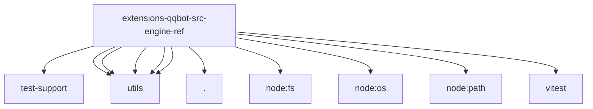

# Imports

[← Back to MODULE](MODULE.md) | [← Back to INDEX](../../INDEX.md)

## Dependency Graph

## External Dependencies

Dependencies from other modules:

- `../../test-support/runtime.js`
- `../utils/attachment-tags.js`
- `../utils/format.js`
- `../utils/log.js`
- `../utils/sqlite-state.js`
- `../utils/text-parsing.js`
- `./format-ref-entry.js`
- `node:fs`
- `node:os`
- `node:path`
- `vitest`
