# Imports

[← Back to MODULE](MODULE.md) | [← Back to INDEX](../../INDEX.md)

## Dependency Graph

```mermaid
graph TD
    extensions_raft_src[extensions-raft-src] --> _[.]
    extensions_raft_src[extensions-raft-src] --> _[.]
    extensions_raft_src[extensions-raft-src] --> _[.]
    extensions_raft_src[extensions-raft-src] --> _[.]
    extensions_raft_src[extensions-raft-src] --> _[.]
    extensions_raft_src[extensions-raft-src] --> _[.]
    extensions_raft_src[extensions-raft-src] --> node_child_process[node:child_process]
    extensions_raft_src[extensions-raft-src] --> node_crypto[node:crypto]
    extensions_raft_src[extensions-raft-src] --> node_events[node:events]
    extensions_raft_src[extensions-raft-src] --> node_fs[node:fs]
    extensions_raft_src[extensions-raft-src] --> node_http[node:http]
    extensions_raft_src[extensions-raft-src] --> node_os[node:os]
    extensions_raft_src[extensions-raft-src] --> node_path[node:path]
    extensions_raft_src[extensions-raft-src] --> plugin_sdk[plugin-sdk]
    extensions_raft_src[extensions-raft-src] --> plugin_sdk[plugin-sdk]
    extensions_raft_src[extensions-raft-src] --> plugin_sdk[plugin-sdk]
    extensions_raft_src[extensions-raft-src] --> plugin_sdk[plugin-sdk]
    extensions_raft_src[extensions-raft-src] --> plugin_sdk[plugin-sdk]
    extensions_raft_src[extensions-raft-src] --> plugin_sdk[plugin-sdk]
    extensions_raft_src[extensions-raft-src] --> plugin_sdk[plugin-sdk]
    extensions_raft_src[extensions-raft-src] --> plugin_sdk[plugin-sdk]
    extensions_raft_src[extensions-raft-src] --> plugin_sdk[plugin-sdk]
    extensions_raft_src[extensions-raft-src] --> plugin_sdk[plugin-sdk]
    extensions_raft_src[extensions-raft-src] --> plugin_sdk[plugin-sdk]
    extensions_raft_src[extensions-raft-src] --> plugin_sdk[plugin-sdk]
    extensions_raft_src[extensions-raft-src] --> plugin_sdk[plugin-sdk]
    extensions_raft_src[extensions-raft-src] --> vitest[vitest]
    extensions_raft_src[extensions-raft-src] --> zod[zod]
```

## External Dependencies

Dependencies from other modules:

- `./accounts.js`
- `./channel.js`
- `./config-schema.js`
- `./gateway.js`
- `./inbound.js`
- `./setup.js`
- `node:child_process`
- `node:crypto`
- `node:events`
- `node:fs`
- `node:http`
- `node:os`
- `node:path`
- `openclaw/plugin-sdk/account-helpers`
- `openclaw/plugin-sdk/account-id`
- `openclaw/plugin-sdk/channel-config-schema`
- `openclaw/plugin-sdk/channel-core`
- `openclaw/plugin-sdk/channel-outbound`
- `openclaw/plugin-sdk/keyed-async-queue`
- `openclaw/plugin-sdk/persistent-dedupe`
- `openclaw/plugin-sdk/plugin-state-test-runtime`
- `openclaw/plugin-sdk/security-runtime`
- `openclaw/plugin-sdk/setup`
- `openclaw/plugin-sdk/setup-tools`
- `openclaw/plugin-sdk/status-helpers`
- `openclaw/plugin-sdk/string-coerce-runtime`
- `vitest`
- `zod`
