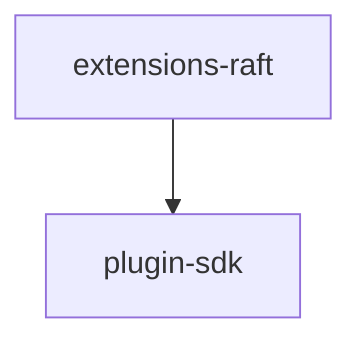

# Module: extensions/raft

[← Back to INDEX](../../INDEX.md)

**Type:** js/ts | **Files:** 4

**Entry point:** `extensions/raft/index.ts`

## Files

| File | Lines | Large |
| ---- | ----- | ----- |
| `extensions/raft/channel-plugin-api.ts` | 2 |  |
| `extensions/raft/index.ts` | 13 |  |
| `extensions/raft/setup-entry.ts` | 10 |  |
| `extensions/raft/setup-plugin-api.ts` | 2 |  |

## Child Modules

- [extensions-raft-src](../extensions-raft-src/MODULE.md)

---

## External Dependencies

Dependencies from other modules:

- `openclaw/plugin-sdk/channel-entry-contract`
