# Imports

[← Back to MODULE](MODULE.md) | [← Back to INDEX](../../INDEX.md)

## Dependency Graph

```mermaid
graph TD
    extensions_reef_protocol[extensions-reef-protocol] --> _[.]
    extensions_reef_protocol[extensions-reef-protocol] --> _[.]
    extensions_reef_protocol[extensions-reef-protocol] --> _[.]
    extensions_reef_protocol[extensions-reef-protocol] --> _[.]
    extensions_reef_protocol[extensions-reef-protocol] --> _[.]
    extensions_reef_protocol[extensions-reef-protocol] --> _[.]
    extensions_reef_protocol[extensions-reef-protocol] --> _[.]
    extensions_reef_protocol[extensions-reef-protocol] --> _[.]
    extensions_reef_protocol[extensions-reef-protocol] --> _[.]
    extensions_reef_protocol[extensions-reef-protocol] --> _[.]
    extensions_reef_protocol[extensions-reef-protocol] --> _[.]
    extensions_reef_protocol[extensions-reef-protocol] --> _[.]
    extensions_reef_protocol[extensions-reef-protocol] --> _[.]
    extensions_reef_protocol[extensions-reef-protocol] --> _[.]
    extensions_reef_protocol[extensions-reef-protocol] --> ciphers[ciphers]
    extensions_reef_protocol[extensions-reef-protocol] --> curves[curves]
    extensions_reef_protocol[extensions-reef-protocol] --> hashes[hashes]
    extensions_reef_protocol[extensions-reef-protocol] --> hashes[hashes]
    extensions_reef_protocol[extensions-reef-protocol] --> hashes[hashes]
    extensions_reef_protocol[extensions-reef-protocol] --> hashes[hashes]
    extensions_reef_protocol[extensions-reef-protocol] --> node_fs[node:fs]
    extensions_reef_protocol[extensions-reef-protocol] --> node_os[node:os]
    extensions_reef_protocol[extensions-reef-protocol] --> node_path[node:path]
    extensions_reef_protocol[extensions-reef-protocol] --> plugin_sdk[plugin-sdk]
    extensions_reef_protocol[extensions-reef-protocol] --> vitest[vitest]
```

## External Dependencies

Dependencies from other modules:

- `./audit.js`
- `./canonical.js`
- `./checks.js`
- `./encoding.js`
- `./envelope.js`
- `./friendcode.js`
- `./guard-adapters.js`
- `./guard.js`
- `./identity.js`
- `./node.js`
- `./pipeline.js`
- `./receipts.js`
- `./replay.js`
- `./ulid.js`
- `@noble/ciphers/aes.js`
- `@noble/curves/ed25519.js`
- `@noble/hashes/hkdf.js`
- `@noble/hashes/hmac.js`
- `@noble/hashes/sha2.js`
- `@noble/hashes/utils.js`
- `node:fs/promises`
- `node:os`
- `node:path`
- `openclaw/plugin-sdk/provider-http`
- `vitest`
