# Imports

[← Back to MODULE](MODULE.md) | [← Back to INDEX](../../INDEX.md)

## Dependency Graph

```mermaid
graph TD
    extensions_reef_src[extensions-reef-src] --> __[..]
    extensions_reef_src[extensions-reef-src] --> protocol[protocol]
    extensions_reef_src[extensions-reef-src] --> _[.]
    extensions_reef_src[extensions-reef-src] --> _[.]
    extensions_reef_src[extensions-reef-src] --> _[.]
    extensions_reef_src[extensions-reef-src] --> _[.]
    extensions_reef_src[extensions-reef-src] --> _[.]
    extensions_reef_src[extensions-reef-src] --> _[.]
    extensions_reef_src[extensions-reef-src] --> _[.]
    extensions_reef_src[extensions-reef-src] --> _[.]
    extensions_reef_src[extensions-reef-src] --> _[.]
    extensions_reef_src[extensions-reef-src] --> _[.]
    extensions_reef_src[extensions-reef-src] --> _[.]
    extensions_reef_src[extensions-reef-src] --> _[.]
    extensions_reef_src[extensions-reef-src] --> _[.]
    extensions_reef_src[extensions-reef-src] --> _[.]
    extensions_reef_src[extensions-reef-src] --> _[.]
    extensions_reef_src[extensions-reef-src] --> _[.]
    extensions_reef_src[extensions-reef-src] --> _[.]
    extensions_reef_src[extensions-reef-src] --> _[.]
    extensions_reef_src[extensions-reef-src] --> _[.]
    extensions_reef_src[extensions-reef-src] --> _[.]
    extensions_reef_src[extensions-reef-src] --> ciphers[ciphers]
    extensions_reef_src[extensions-reef-src] --> hashes[hashes]
    extensions_reef_src[extensions-reef-src] --> node_crypto[node:crypto]
    extensions_reef_src[extensions-reef-src] --> node_events[node:events]
    extensions_reef_src[extensions-reef-src] --> node_fs[node:fs]
    extensions_reef_src[extensions-reef-src] --> node_fs[node:fs]
    extensions_reef_src[extensions-reef-src] --> node_http[node:http]
    extensions_reef_src[extensions-reef-src] --> node_os[node:os]
    extensions_reef_src[extensions-reef-src] --> node_path[node:path]
    extensions_reef_src[extensions-reef-src] --> node_timers[node:timers]
    extensions_reef_src[extensions-reef-src] --> plugin_sdk[plugin-sdk]
    extensions_reef_src[extensions-reef-src] --> plugin_sdk[plugin-sdk]
    extensions_reef_src[extensions-reef-src] --> plugin_sdk[plugin-sdk]
    extensions_reef_src[extensions-reef-src] --> plugin_sdk[plugin-sdk]
    extensions_reef_src[extensions-reef-src] --> plugin_sdk[plugin-sdk]
    extensions_reef_src[extensions-reef-src] --> plugin_sdk[plugin-sdk]
    extensions_reef_src[extensions-reef-src] --> plugin_sdk[plugin-sdk]
    extensions_reef_src[extensions-reef-src] --> plugin_sdk[plugin-sdk]
    extensions_reef_src[extensions-reef-src] --> plugin_sdk[plugin-sdk]
    extensions_reef_src[extensions-reef-src] --> plugin_sdk[plugin-sdk]
    extensions_reef_src[extensions-reef-src] --> plugin_sdk[plugin-sdk]
    extensions_reef_src[extensions-reef-src] --> plugin_sdk[plugin-sdk]
    extensions_reef_src[extensions-reef-src] --> plugin_sdk[plugin-sdk]
    extensions_reef_src[extensions-reef-src] --> plugin_sdk[plugin-sdk]
    extensions_reef_src[extensions-reef-src] --> plugin_sdk[plugin-sdk]
    extensions_reef_src[extensions-reef-src] --> plugin_sdk[plugin-sdk]
    extensions_reef_src[extensions-reef-src] --> plugin_sdk[plugin-sdk]
    extensions_reef_src[extensions-reef-src] --> plugin_sdk[plugin-sdk]
    extensions_reef_src[extensions-reef-src] --> plugin_sdk[plugin-sdk]
    extensions_reef_src[extensions-reef-src] --> plugin_sdk[plugin-sdk]
    extensions_reef_src[extensions-reef-src] --> vitest[vitest]
    extensions_reef_src[extensions-reef-src] --> ws[ws]
    extensions_reef_src[extensions-reef-src] --> zod[zod]
```

## External Dependencies

Dependencies from other modules:

- `../index.js`
- `../protocol/index.js`
- `./audit-state.js`
- `./channel-lifecycle.js`
- `./channel.js`
- `./config-schema.js`
- `./doctor-state-paths.js`
- `./flow.js`
- `./flow.test-helpers.js`
- `./friend-types.js`
- `./friends.js`
- `./inbound.js`
- `./legacy-key-guard.js`
- `./outbound.js`
- `./owner-notice.js`
- `./registration-state.js`
- `./rejection-resend.js`
- `./runtime.js`
- `./setup.js`
- `./state.js`
- `./transport.js`
- `./trust-store.js`
- `@noble/ciphers/aes.js`
- `@noble/hashes/utils.js`
- `node:crypto`
- `node:events`
- `node:fs`
- `node:fs/promises`
- `node:http`
- `node:os`
- `node:path`
- `node:timers/promises`
- `openclaw/plugin-sdk/account-resolution`
- `openclaw/plugin-sdk/channel-inbound`
- `openclaw/plugin-sdk/channel-outbound`
- `openclaw/plugin-sdk/channel-pairing`
- `openclaw/plugin-sdk/channel-status`
- `openclaw/plugin-sdk/config-mutation`
- `openclaw/plugin-sdk/core`
- `openclaw/plugin-sdk/directory-runtime`
- `openclaw/plugin-sdk/error-runtime`
- `openclaw/plugin-sdk/extension-shared`
- `openclaw/plugin-sdk/plugin-state-test-runtime`
- `openclaw/plugin-sdk/plugin-test-runtime`
- `openclaw/plugin-sdk/provider-http`
- `openclaw/plugin-sdk/runtime`
- `openclaw/plugin-sdk/runtime-doctor`
- `openclaw/plugin-sdk/runtime-store`
- `openclaw/plugin-sdk/state-paths`
- `openclaw/plugin-sdk/string-coerce-runtime`
- `openclaw/plugin-sdk/temp-path`
- `openclaw/plugin-sdk/test-fixtures`
- `vitest`
- `ws`
- `zod`
