# Imports

[← Back to MODULE](MODULE.md) | [← Back to INDEX](../../INDEX.md)

## Dependency Graph

```mermaid
graph TD
    extensions_reef[extensions-reef] --> _[.]
    extensions_reef[extensions-reef] --> _[.]
    extensions_reef[extensions-reef] --> _[.]
    extensions_reef[extensions-reef] --> protocol[protocol]
    extensions_reef[extensions-reef] --> src[src]
    extensions_reef[extensions-reef] --> src[src]
    extensions_reef[extensions-reef] --> src[src]
    extensions_reef[extensions-reef] --> src[src]
    extensions_reef[extensions-reef] --> src[src]
    extensions_reef[extensions-reef] --> src[src]
    extensions_reef[extensions-reef] --> src[src]
    extensions_reef[extensions-reef] --> src[src]
    extensions_reef[extensions-reef] --> src[src]
    extensions_reef[extensions-reef] --> node_fs[node:fs]
    extensions_reef[extensions-reef] --> node_fs[node:fs]
    extensions_reef[extensions-reef] --> node_os[node:os]
    extensions_reef[extensions-reef] --> node_path[node:path]
    extensions_reef[extensions-reef] --> plugin_sdk[plugin-sdk]
    extensions_reef[extensions-reef] --> plugin_sdk[plugin-sdk]
    extensions_reef[extensions-reef] --> plugin_sdk[plugin-sdk]
    extensions_reef[extensions-reef] --> plugin_sdk[plugin-sdk]
    extensions_reef[extensions-reef] --> plugin_sdk[plugin-sdk]
    extensions_reef[extensions-reef] --> plugin_sdk[plugin-sdk]
    extensions_reef[extensions-reef] --> plugin_sdk[plugin-sdk]
    extensions_reef[extensions-reef] --> vitest[vitest]
    extensions_reef[extensions-reef] --> zod[zod]
```

## External Dependencies

Dependencies from other modules:

- `./cli-metadata.js`
- `./doctor-contract-api.js`
- `./index.js`
- `./protocol/index.js`
- `./src/channel.js`
- `./src/cli-metadata.js`
- `./src/config-schema.js`
- `./src/doctor-durable-state.js`
- `./src/doctor-state-paths.js`
- `./src/friend-types.js`
- `./src/outbound.js`
- `./src/state.js`
- `./src/trust-store.js`
- `node:fs`
- `node:fs/promises`
- `node:os`
- `node:path`
- `openclaw/plugin-sdk/channel-entry-contract`
- `openclaw/plugin-sdk/core`
- `openclaw/plugin-sdk/lazy-runtime`
- `openclaw/plugin-sdk/plugin-state-test-runtime`
- `openclaw/plugin-sdk/plugin-test-runtime`
- `openclaw/plugin-sdk/runtime-doctor`
- `openclaw/plugin-sdk/string-coerce-runtime`
- `vitest`
- `zod`
