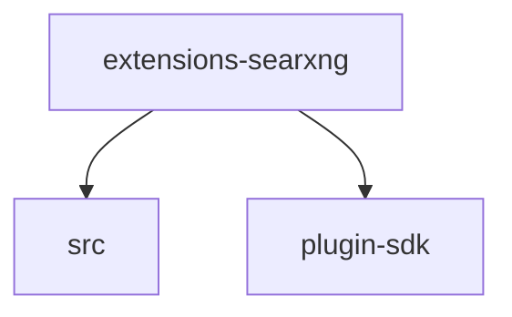

# Module: extensions/searxng

[← Back to INDEX](../../INDEX.md)

**Type:** js/ts | **Files:** 2

**Entry point:** `extensions/searxng/index.ts`

## Files

| File | Lines | Large |
| ---- | ----- | ----- |
| `extensions/searxng/index.ts` | 12 |  |
| `extensions/searxng/web-search-provider.ts` | 2 |  |

## Child Modules

- [extensions-searxng-src](../extensions-searxng-src/MODULE.md)

---

## External Dependencies

Dependencies from other modules:

- `./src/searxng-search-provider.js`
- `openclaw/plugin-sdk/plugin-entry`
