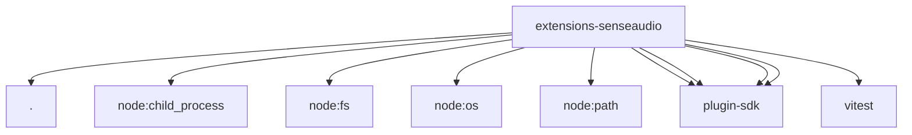

# Imports

[← Back to MODULE](MODULE.md) | [← Back to INDEX](../../INDEX.md)

## Dependency Graph

## External Dependencies

Dependencies from other modules:

- `./media-understanding-provider.js`
- `node:child_process`
- `node:fs`
- `node:os`
- `node:path`
- `openclaw/plugin-sdk/media-runtime`
- `openclaw/plugin-sdk/media-understanding`
- `openclaw/plugin-sdk/plugin-entry`
- `openclaw/plugin-sdk/test-media-understanding`
- `vitest`
