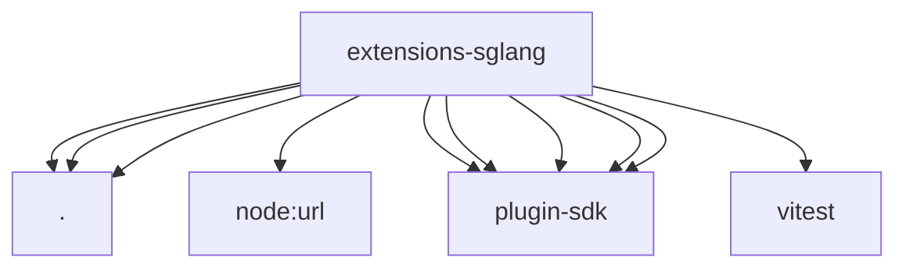

# Imports

[← Back to MODULE](MODULE.md) | [← Back to INDEX](../../INDEX.md)

## Dependency Graph

## External Dependencies

Dependencies from other modules:

- `./api.js`
- `./defaults.js`
- `./index.js`
- `node:url`
- `openclaw/plugin-sdk/plugin-entry`
- `openclaw/plugin-sdk/plugin-test-runtime`
- `openclaw/plugin-sdk/provider-model-shared`
- `openclaw/plugin-sdk/provider-setup`
- `openclaw/plugin-sdk/provider-test-contracts`
- `vitest`
