# Imports

[← Back to MODULE](MODULE.md) | [← Back to INDEX](../../INDEX.md)

## Dependency Graph

```mermaid
graph TD
    extensions_slack_src_monitor_events[extensions-slack-src-monitor-events] --> __[..]
    extensions_slack_src_monitor_events[extensions-slack-src-monitor-events] --> __[..]
    extensions_slack_src_monitor_events[extensions-slack-src-monitor-events] --> __[..]
    extensions_slack_src_monitor_events[extensions-slack-src-monitor-events] --> __[..]
    extensions_slack_src_monitor_events[extensions-slack-src-monitor-events] --> __[..]
    extensions_slack_src_monitor_events[extensions-slack-src-monitor-events] --> __[..]
    extensions_slack_src_monitor_events[extensions-slack-src-monitor-events] --> __[..]
    extensions_slack_src_monitor_events[extensions-slack-src-monitor-events] --> __[..]
    extensions_slack_src_monitor_events[extensions-slack-src-monitor-events] --> __[..]
    extensions_slack_src_monitor_events[extensions-slack-src-monitor-events] --> __[..]
    extensions_slack_src_monitor_events[extensions-slack-src-monitor-events] --> __[..]
    extensions_slack_src_monitor_events[extensions-slack-src-monitor-events] --> __[..]
    extensions_slack_src_monitor_events[extensions-slack-src-monitor-events] --> __[..]
    extensions_slack_src_monitor_events[extensions-slack-src-monitor-events] --> __[..]
    extensions_slack_src_monitor_events[extensions-slack-src-monitor-events] --> __[..]
    extensions_slack_src_monitor_events[extensions-slack-src-monitor-events] --> __[..]
    extensions_slack_src_monitor_events[extensions-slack-src-monitor-events] --> __[..]
    extensions_slack_src_monitor_events[extensions-slack-src-monitor-events] --> message_handler[message-handler]
    extensions_slack_src_monitor_events[extensions-slack-src-monitor-events] --> __[..]
    extensions_slack_src_monitor_events[extensions-slack-src-monitor-events] --> _[.]
    extensions_slack_src_monitor_events[extensions-slack-src-monitor-events] --> _[.]
    extensions_slack_src_monitor_events[extensions-slack-src-monitor-events] --> _[.]
    extensions_slack_src_monitor_events[extensions-slack-src-monitor-events] --> _[.]
    extensions_slack_src_monitor_events[extensions-slack-src-monitor-events] --> _[.]
    extensions_slack_src_monitor_events[extensions-slack-src-monitor-events] --> _[.]
    extensions_slack_src_monitor_events[extensions-slack-src-monitor-events] --> _[.]
    extensions_slack_src_monitor_events[extensions-slack-src-monitor-events] --> plugin_sdk[plugin-sdk]
    extensions_slack_src_monitor_events[extensions-slack-src-monitor-events] --> plugin_sdk[plugin-sdk]
    extensions_slack_src_monitor_events[extensions-slack-src-monitor-events] --> plugin_sdk[plugin-sdk]
    extensions_slack_src_monitor_events[extensions-slack-src-monitor-events] --> plugin_sdk[plugin-sdk]
    extensions_slack_src_monitor_events[extensions-slack-src-monitor-events] --> plugin_sdk[plugin-sdk]
    extensions_slack_src_monitor_events[extensions-slack-src-monitor-events] --> plugin_sdk[plugin-sdk]
    extensions_slack_src_monitor_events[extensions-slack-src-monitor-events] --> plugin_sdk[plugin-sdk]
    extensions_slack_src_monitor_events[extensions-slack-src-monitor-events] --> plugin_sdk[plugin-sdk]
    extensions_slack_src_monitor_events[extensions-slack-src-monitor-events] --> plugin_sdk[plugin-sdk]
    extensions_slack_src_monitor_events[extensions-slack-src-monitor-events] --> plugin_sdk[plugin-sdk]
    extensions_slack_src_monitor_events[extensions-slack-src-monitor-events] --> plugin_sdk[plugin-sdk]
    extensions_slack_src_monitor_events[extensions-slack-src-monitor-events] --> plugin_sdk[plugin-sdk]
    extensions_slack_src_monitor_events[extensions-slack-src-monitor-events] --> vitest[vitest]
```

## External Dependencies

Dependencies from other modules:

- `../../approval-actions.js`
- `../../approval-auth.js`
- `../../channel-migration.js`
- `../../exec-approvals.js`
- `../../interactive-dispatch.js`
- `../../modal-metadata.js`
- `../../question-actions.js`
- `../../reply-action-ids.js`
- `../../truncate.js`
- `../allow-list.js`
- `../auth.js`
- `../channel-config.js`
- `../channel-type.js`
- `../context.js`
- `../conversation.runtime.js`
- `../event-scope.js`
- `../ingress.js`
- `../message-handler/prepare.test-helpers.js`
- `../mrkdwn.js`
- `./assistant.js`
- `./interactions.block-actions.js`
- `./interactions.modal.js`
- `./interactions.shortcuts.js`
- `./message-subtype-handlers.js`
- `./system-event-context.js`
- `./system-event-test-harness.js`
- `openclaw/plugin-sdk/approval-gateway-runtime`
- `openclaw/plugin-sdk/approval-reply-runtime`
- `openclaw/plugin-sdk/channel-config-writes`
- `openclaw/plugin-sdk/command-auth-native`
- `openclaw/plugin-sdk/config-mutation`
- `openclaw/plugin-sdk/error-runtime`
- `openclaw/plugin-sdk/heartbeat-runtime`
- `openclaw/plugin-sdk/number-runtime`
- `openclaw/plugin-sdk/runtime-config-snapshot`
- `openclaw/plugin-sdk/runtime-env`
- `openclaw/plugin-sdk/string-coerce-runtime`
- `openclaw/plugin-sdk/system-event-runtime`
- `vitest`
