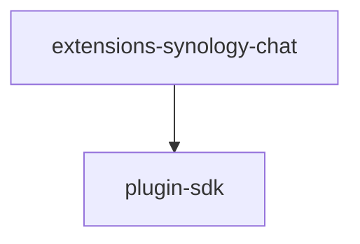

# Module: extensions/synology-chat

[← Back to INDEX](../../INDEX.md)

**Type:** js/ts | **Files:** 6

**Entry point:** `extensions/synology-chat/index.ts`

## Files

| File | Lines | Large |
| ---- | ----- | ----- |
| `extensions/synology-chat/api.ts` | 4 |  |
| `extensions/synology-chat/channel-plugin-api.ts` | 2 |  |
| `extensions/synology-chat/contract-api.ts` | 2 |  |
| `extensions/synology-chat/index.ts` | 17 |  |
| `extensions/synology-chat/setup-api.ts` | 2 |  |
| `extensions/synology-chat/setup-entry.ts` | 10 |  |

## Child Modules

- [extensions-synology-chat-src](../extensions-synology-chat-src/MODULE.md)

---

## External Dependencies

Dependencies from other modules:

- `openclaw/plugin-sdk/channel-entry-contract`
