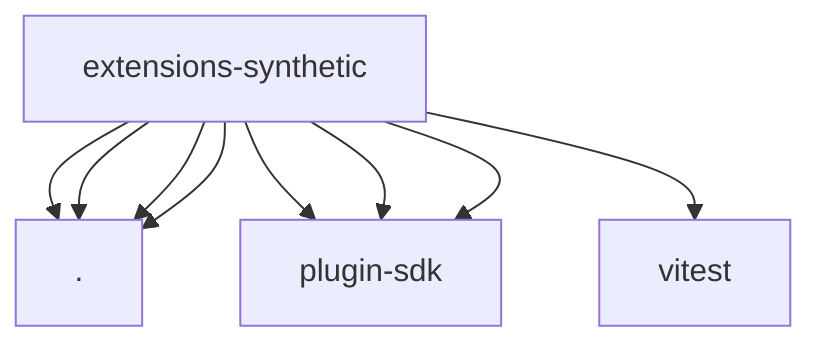

# Imports

[← Back to MODULE](MODULE.md) | [← Back to INDEX](../../INDEX.md)

## Dependency Graph

## External Dependencies

Dependencies from other modules:

- `./api.js`
- `./models.js`
- `./onboard.js`
- `./provider-catalog.js`
- `openclaw/plugin-sdk/provider-entry`
- `openclaw/plugin-sdk/provider-onboard`
- `openclaw/plugin-sdk/provider-test-contracts`
- `vitest`
