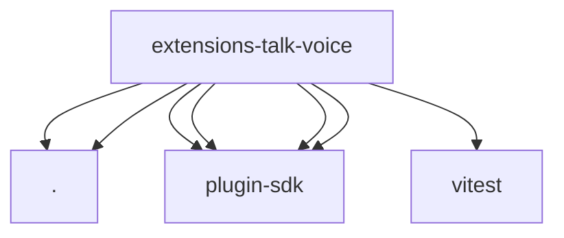

# Imports

[← Back to MODULE](MODULE.md) | [← Back to INDEX](../../INDEX.md)

## Dependency Graph

## External Dependencies

Dependencies from other modules:

- `./api.js`
- `./index.js`
- `openclaw/plugin-sdk/error-runtime`
- `openclaw/plugin-sdk/number-runtime`
- `openclaw/plugin-sdk/string-coerce-runtime`
- `openclaw/plugin-sdk/talk-config-runtime`
- `vitest`
