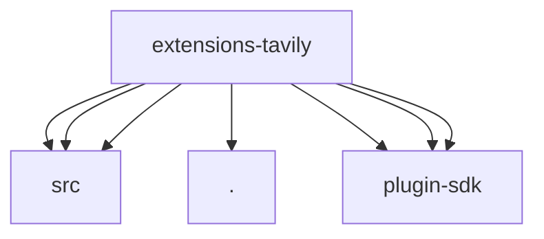

# Imports

[← Back to MODULE](MODULE.md) | [← Back to INDEX](../../INDEX.md)

## Dependency Graph

## External Dependencies

Dependencies from other modules:

- `./src/tavily-extract-tool.js`
- `./src/tavily-search-provider.js`
- `./src/tavily-search-tool.js`
- `./web-search-shared.js`
- `openclaw/plugin-sdk/lazy-runtime`
- `openclaw/plugin-sdk/plugin-entry`
- `openclaw/plugin-sdk/provider-web-search-contract`
