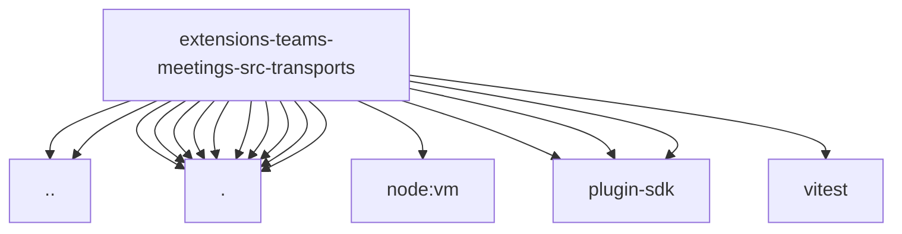

# Imports

[← Back to MODULE](MODULE.md) | [← Back to INDEX](../../INDEX.md)

## Dependency Graph

## External Dependencies

Dependencies from other modules:

- `../agent-consult.js`
- `../config.js`
- `./chrome-audio-device.js`
- `./chrome.js`
- `./teams-meetings-page-scripts.js`
- `./teams-meetings-platform-adapter.js`
- `./teams-meetings-platform-adapter.test-helpers.js`
- `./teams-meetings-platform-constants.js`
- `./teams-meetings-selectors.js`
- `./teams-meetings-status-call-source.js`
- `./teams-meetings-status-prejoin-source.js`
- `./teams-meetings-urls.js`
- `node:vm`
- `openclaw/plugin-sdk/error-runtime`
- `openclaw/plugin-sdk/meeting-runtime`
- `openclaw/plugin-sdk/number-runtime`
- `vitest`
