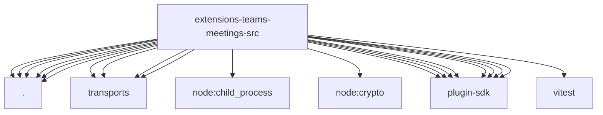

# Imports

[← Back to MODULE](MODULE.md) | [← Back to INDEX](../../INDEX.md)

## Dependency Graph

## External Dependencies

Dependencies from other modules:

- `./config.js`
- `./node-invoke-policy.js`
- `./runtime-probes.js`
- `./runtime-session.js`
- `./runtime-setup.js`
- `./runtime.js`
- `./transports/chrome-audio-device.js`
- `./transports/chrome.js`
- `./transports/teams-meetings-platform-adapter.js`
- `./transports/teams-meetings-platform-constants.js`
- `node:child_process`
- `node:crypto`
- `openclaw/plugin-sdk/error-runtime`
- `openclaw/plugin-sdk/gateway-runtime`
- `openclaw/plugin-sdk/meeting-runtime`
- `openclaw/plugin-sdk/number-runtime`
- `openclaw/plugin-sdk/realtime-voice`
- `openclaw/plugin-sdk/routing`
- `openclaw/plugin-sdk/runtime-env`
- `openclaw/plugin-sdk/string-coerce-runtime`
- `vitest`
