# Imports

[← Back to MODULE](MODULE.md) | [← Back to INDEX](../../INDEX.md)

## Dependency Graph

```mermaid
graph TD
    extensions_teams_meetings[extensions-teams-meetings] --> _[.]
    extensions_teams_meetings[extensions-teams-meetings] --> _[.]
    extensions_teams_meetings[extensions-teams-meetings] --> _[.]
    extensions_teams_meetings[extensions-teams-meetings] --> _[.]
    extensions_teams_meetings[extensions-teams-meetings] --> _[.]
    extensions_teams_meetings[extensions-teams-meetings] --> _[.]
    extensions_teams_meetings[extensions-teams-meetings] --> _[.]
    extensions_teams_meetings[extensions-teams-meetings] --> src[src]
    extensions_teams_meetings[extensions-teams-meetings] --> src[src]
    extensions_teams_meetings[extensions-teams-meetings] --> src[src]
    extensions_teams_meetings[extensions-teams-meetings] --> src[src]
    extensions_teams_meetings[extensions-teams-meetings] --> transports[transports]
    extensions_teams_meetings[extensions-teams-meetings] --> transports[transports]
    extensions_teams_meetings[extensions-teams-meetings] --> transports[transports]
    extensions_teams_meetings[extensions-teams-meetings] --> transports[transports]
    extensions_teams_meetings[extensions-teams-meetings] --> transports[transports]
    extensions_teams_meetings[extensions-teams-meetings] --> transports[transports]
    extensions_teams_meetings[extensions-teams-meetings] --> node_child_process[node:child_process]
    extensions_teams_meetings[extensions-teams-meetings] --> node_crypto[node:crypto]
    extensions_teams_meetings[extensions-teams-meetings] --> plugin_sdk[plugin-sdk]
    extensions_teams_meetings[extensions-teams-meetings] --> plugin_sdk[plugin-sdk]
    extensions_teams_meetings[extensions-teams-meetings] --> plugin_sdk[plugin-sdk]
    extensions_teams_meetings[extensions-teams-meetings] --> plugin_sdk[plugin-sdk]
    extensions_teams_meetings[extensions-teams-meetings] --> plugin_sdk[plugin-sdk]
    extensions_teams_meetings[extensions-teams-meetings] --> plugin_sdk[plugin-sdk]
    extensions_teams_meetings[extensions-teams-meetings] --> plugin_sdk[plugin-sdk]
    extensions_teams_meetings[extensions-teams-meetings] --> plugin_sdk[plugin-sdk]
    extensions_teams_meetings[extensions-teams-meetings] --> plugin_sdk[plugin-sdk]
    extensions_teams_meetings[extensions-teams-meetings] --> plugin_sdk[plugin-sdk]
    extensions_teams_meetings[extensions-teams-meetings] --> plugin_sdk[plugin-sdk]
    extensions_teams_meetings[extensions-teams-meetings] --> plugin_sdk[plugin-sdk]
    extensions_teams_meetings[extensions-teams-meetings] --> plugin_sdk[plugin-sdk]
    extensions_teams_meetings[extensions-teams-meetings] --> typebox[typebox]
    extensions_teams_meetings[extensions-teams-meetings] --> vitest[vitest]
```

## External Dependencies

Dependencies from other modules:

- `./config.js`
- `./index.js`
- `./node-invoke-policy.js`
- `./runtime-probes.js`
- `./runtime-session.js`
- `./runtime-setup.js`
- `./runtime.js`
- `./src/config.js`
- `./src/node-host.js`
- `./src/node-invoke-policy.js`
- `./src/runtime.js`
- `./src/transports/teams-meetings-platform-constants.js`
- `./src/transports/teams-meetings-urls.js`
- `./transports/chrome-audio-device.js`
- `./transports/chrome.js`
- `./transports/teams-meetings-platform-adapter.js`
- `./transports/teams-meetings-platform-constants.js`
- `node:child_process`
- `node:crypto`
- `openclaw/plugin-sdk/channel-actions`
- `openclaw/plugin-sdk/error-runtime`
- `openclaw/plugin-sdk/gateway-runtime`
- `openclaw/plugin-sdk/lazy-runtime`
- `openclaw/plugin-sdk/meeting-runtime`
- `openclaw/plugin-sdk/number-runtime`
- `openclaw/plugin-sdk/plugin-entry`
- `openclaw/plugin-sdk/plugin-test-api`
- `openclaw/plugin-sdk/realtime-voice`
- `openclaw/plugin-sdk/routing`
- `openclaw/plugin-sdk/runtime-env`
- `openclaw/plugin-sdk/string-coerce-runtime`
- `openclaw/plugin-sdk/tool-results`
- `typebox`
- `vitest`
