# Imports

[← Back to MODULE](MODULE.md) | [← Back to INDEX](../../INDEX.md)

## Dependency Graph

```mermaid
graph TD
    extensions_telegram_src_bot[extensions-telegram-src-bot] --> __[..]
    extensions_telegram_src_bot[extensions-telegram-src-bot] --> __[..]
    extensions_telegram_src_bot[extensions-telegram-src-bot] --> __[..]
    extensions_telegram_src_bot[extensions-telegram-src-bot] --> __[..]
    extensions_telegram_src_bot[extensions-telegram-src-bot] --> __[..]
    extensions_telegram_src_bot[extensions-telegram-src-bot] --> __[..]
    extensions_telegram_src_bot[extensions-telegram-src-bot] --> __[..]
    extensions_telegram_src_bot[extensions-telegram-src-bot] --> __[..]
    extensions_telegram_src_bot[extensions-telegram-src-bot] --> __[..]
    extensions_telegram_src_bot[extensions-telegram-src-bot] --> __[..]
    extensions_telegram_src_bot[extensions-telegram-src-bot] --> __[..]
    extensions_telegram_src_bot[extensions-telegram-src-bot] --> __[..]
    extensions_telegram_src_bot[extensions-telegram-src-bot] --> __[..]
    extensions_telegram_src_bot[extensions-telegram-src-bot] --> __[..]
    extensions_telegram_src_bot[extensions-telegram-src-bot] --> __[..]
    extensions_telegram_src_bot[extensions-telegram-src-bot] --> __[..]
    extensions_telegram_src_bot[extensions-telegram-src-bot] --> __[..]
    extensions_telegram_src_bot[extensions-telegram-src-bot] --> __[..]
    extensions_telegram_src_bot[extensions-telegram-src-bot] --> __[..]
    extensions_telegram_src_bot[extensions-telegram-src-bot] --> __[..]
    extensions_telegram_src_bot[extensions-telegram-src-bot] --> __[..]
    extensions_telegram_src_bot[extensions-telegram-src-bot] --> __[..]
    extensions_telegram_src_bot[extensions-telegram-src-bot] --> _[.]
    extensions_telegram_src_bot[extensions-telegram-src-bot] --> _[.]
    extensions_telegram_src_bot[extensions-telegram-src-bot] --> _[.]
    extensions_telegram_src_bot[extensions-telegram-src-bot] --> _[.]
    extensions_telegram_src_bot[extensions-telegram-src-bot] --> _[.]
    extensions_telegram_src_bot[extensions-telegram-src-bot] --> _[.]
    extensions_telegram_src_bot[extensions-telegram-src-bot] --> _[.]
    extensions_telegram_src_bot[extensions-telegram-src-bot] --> grammy[grammy]
    extensions_telegram_src_bot[extensions-telegram-src-bot] --> node_path[node:path]
    extensions_telegram_src_bot[extensions-telegram-src-bot] --> plugin_sdk[plugin-sdk]
    extensions_telegram_src_bot[extensions-telegram-src-bot] --> plugin_sdk[plugin-sdk]
    extensions_telegram_src_bot[extensions-telegram-src-bot] --> plugin_sdk[plugin-sdk]
    extensions_telegram_src_bot[extensions-telegram-src-bot] --> plugin_sdk[plugin-sdk]
    extensions_telegram_src_bot[extensions-telegram-src-bot] --> plugin_sdk[plugin-sdk]
    extensions_telegram_src_bot[extensions-telegram-src-bot] --> plugin_sdk[plugin-sdk]
    extensions_telegram_src_bot[extensions-telegram-src-bot] --> plugin_sdk[plugin-sdk]
    extensions_telegram_src_bot[extensions-telegram-src-bot] --> plugin_sdk[plugin-sdk]
    extensions_telegram_src_bot[extensions-telegram-src-bot] --> plugin_sdk[plugin-sdk]
    extensions_telegram_src_bot[extensions-telegram-src-bot] --> plugin_sdk[plugin-sdk]
    extensions_telegram_src_bot[extensions-telegram-src-bot] --> plugin_sdk[plugin-sdk]
    extensions_telegram_src_bot[extensions-telegram-src-bot] --> plugin_sdk[plugin-sdk]
    extensions_telegram_src_bot[extensions-telegram-src-bot] --> plugin_sdk[plugin-sdk]
    extensions_telegram_src_bot[extensions-telegram-src-bot] --> plugin_sdk[plugin-sdk]
    extensions_telegram_src_bot[extensions-telegram-src-bot] --> plugin_sdk[plugin-sdk]
    extensions_telegram_src_bot[extensions-telegram-src-bot] --> plugin_sdk[plugin-sdk]
    extensions_telegram_src_bot[extensions-telegram-src-bot] --> plugin_sdk[plugin-sdk]
    extensions_telegram_src_bot[extensions-telegram-src-bot] --> plugin_sdk[plugin-sdk]
    extensions_telegram_src_bot[extensions-telegram-src-bot] --> vitest[vitest]
```

## External Dependencies

Dependencies from other modules:

- `../access-groups.js`
- `../api-logging.js`
- `../bot-access.js`
- `../bot-handlers.media.js`
- `../button-types.js`
- `../caption.js`
- `../fetch.js`
- `../format.js`
- `../interactive-fallback.js`
- `../network-errors.js`
- `../outbound-params.js`
- `../preview-streaming.js`
- `../prompt-context-projection.js`
- `../reply-parameters.js`
- `../retry-after.js`
- `../rich-message.js`
- `../rich-plain-fallback.js`
- `../send.js`
- `../sticker-cache.js`
- `../targets.js`
- `../telegram-media.runtime.js`
- `../voice.js`
- `./body-helpers.js`
- `./delivery.resolve-media.js`
- `./delivery.resolve-media.runtime.js`
- `./delivery.send.js`
- `./helpers.js`
- `./native-quote.js`
- `./reply-threading.js`
- `grammy`
- `node:path`
- `openclaw/plugin-sdk/channel-inbound`
- `openclaw/plugin-sdk/channel-outbound`
- `openclaw/plugin-sdk/command-auth-native`
- `openclaw/plugin-sdk/conversation-runtime`
- `openclaw/plugin-sdk/file-access-runtime`
- `openclaw/plugin-sdk/hook-runtime`
- `openclaw/plugin-sdk/interactive-runtime`
- `openclaw/plugin-sdk/media-runtime`
- `openclaw/plugin-sdk/number-runtime`
- `openclaw/plugin-sdk/plugin-runtime`
- `openclaw/plugin-sdk/reply-chunking`
- `openclaw/plugin-sdk/reply-reference`
- `openclaw/plugin-sdk/retry-runtime`
- `openclaw/plugin-sdk/routing`
- `openclaw/plugin-sdk/runtime-env`
- `openclaw/plugin-sdk/ssrf-runtime`
- `openclaw/plugin-sdk/string-coerce-runtime`
- `openclaw/plugin-sdk/web-media`
- `vitest`
