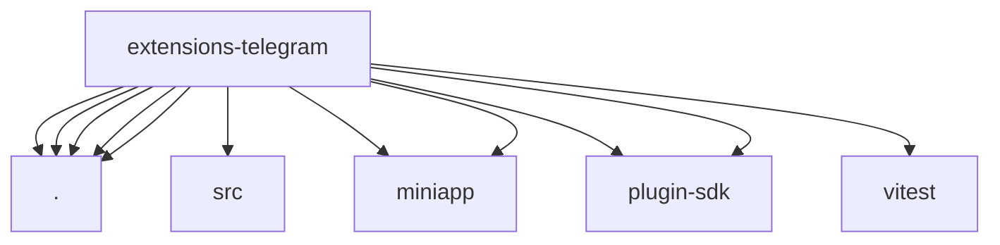

# Imports

[← Back to MODULE](MODULE.md) | [← Back to INDEX](../../INDEX.md)

## Dependency Graph

## External Dependencies

Dependencies from other modules:

- `./api.js`
- `./channel-config-api.js`
- `./index.js`
- `./miniapp-api.js`
- `./setup-entry.js`
- `./src/account-inspect.js`
- `./src/miniapp/command.js`
- `./src/miniapp/routes.js`
- `openclaw/plugin-sdk/channel-entry-contract`
- `openclaw/plugin-sdk/channel-test-helpers`
- `vitest`
