# Imports

[← Back to MODULE](MODULE.md) | [← Back to INDEX](../../INDEX.md)

## Dependency Graph

```mermaid
graph TD
    extensions_tlon_src_monitor[extensions-tlon-src-monitor] --> __[..]
    extensions_tlon_src_monitor[extensions-tlon-src-monitor] --> __[..]
    extensions_tlon_src_monitor[extensions-tlon-src-monitor] --> __[..]
    extensions_tlon_src_monitor[extensions-tlon-src-monitor] --> __[..]
    extensions_tlon_src_monitor[extensions-tlon-src-monitor] --> __[..]
    extensions_tlon_src_monitor[extensions-tlon-src-monitor] --> __[..]
    extensions_tlon_src_monitor[extensions-tlon-src-monitor] --> urbit[urbit]
    extensions_tlon_src_monitor[extensions-tlon-src-monitor] --> urbit[urbit]
    extensions_tlon_src_monitor[extensions-tlon-src-monitor] --> urbit[urbit]
    extensions_tlon_src_monitor[extensions-tlon-src-monitor] --> urbit[urbit]
    extensions_tlon_src_monitor[extensions-tlon-src-monitor] --> urbit[urbit]
    extensions_tlon_src_monitor[extensions-tlon-src-monitor] --> _[.]
    extensions_tlon_src_monitor[extensions-tlon-src-monitor] --> _[.]
    extensions_tlon_src_monitor[extensions-tlon-src-monitor] --> _[.]
    extensions_tlon_src_monitor[extensions-tlon-src-monitor] --> _[.]
    extensions_tlon_src_monitor[extensions-tlon-src-monitor] --> _[.]
    extensions_tlon_src_monitor[extensions-tlon-src-monitor] --> _[.]
    extensions_tlon_src_monitor[extensions-tlon-src-monitor] --> _[.]
    extensions_tlon_src_monitor[extensions-tlon-src-monitor] --> _[.]
    extensions_tlon_src_monitor[extensions-tlon-src-monitor] --> _[.]
    extensions_tlon_src_monitor[extensions-tlon-src-monitor] --> _[.]
    extensions_tlon_src_monitor[extensions-tlon-src-monitor] --> _[.]
    extensions_tlon_src_monitor[extensions-tlon-src-monitor] --> node_crypto[node:crypto]
    extensions_tlon_src_monitor[extensions-tlon-src-monitor] --> node_fs[node:fs]
    extensions_tlon_src_monitor[extensions-tlon-src-monitor] --> node_os[node:os]
    extensions_tlon_src_monitor[extensions-tlon-src-monitor] --> node_path[node:path]
    extensions_tlon_src_monitor[extensions-tlon-src-monitor] --> plugin_sdk[plugin-sdk]
    extensions_tlon_src_monitor[extensions-tlon-src-monitor] --> plugin_sdk[plugin-sdk]
    extensions_tlon_src_monitor[extensions-tlon-src-monitor] --> plugin_sdk[plugin-sdk]
    extensions_tlon_src_monitor[extensions-tlon-src-monitor] --> plugin_sdk[plugin-sdk]
    extensions_tlon_src_monitor[extensions-tlon-src-monitor] --> plugin_sdk[plugin-sdk]
    extensions_tlon_src_monitor[extensions-tlon-src-monitor] --> plugin_sdk[plugin-sdk]
    extensions_tlon_src_monitor[extensions-tlon-src-monitor] --> plugin_sdk[plugin-sdk]
    extensions_tlon_src_monitor[extensions-tlon-src-monitor] --> plugin_sdk[plugin-sdk]
    extensions_tlon_src_monitor[extensions-tlon-src-monitor] --> plugin_sdk[plugin-sdk]
    extensions_tlon_src_monitor[extensions-tlon-src-monitor] --> plugin_sdk[plugin-sdk]
    extensions_tlon_src_monitor[extensions-tlon-src-monitor] --> plugin_sdk[plugin-sdk]
    extensions_tlon_src_monitor[extensions-tlon-src-monitor] --> plugin_sdk[plugin-sdk]
    extensions_tlon_src_monitor[extensions-tlon-src-monitor] --> plugin_sdk[plugin-sdk]
    extensions_tlon_src_monitor[extensions-tlon-src-monitor] --> vitest[vitest]
```

## External Dependencies

Dependencies from other modules:

- `../../runtime-api.js`
- `../media-fetch-timeouts.js`
- `../runtime.js`
- `../settings.js`
- `../targets.js`
- `../types.js`
- `../urbit/auth.js`
- `../urbit/context.js`
- `../urbit/errors.js`
- `../urbit/send.js`
- `../urbit/sse-client.js`
- `./approval-runtime.js`
- `./approval.js`
- `./authorization.js`
- `./cites.js`
- `./discovery.js`
- `./history.js`
- `./index.js`
- `./ingress.js`
- `./media.js`
- `./settings-helpers.js`
- `./utils.js`
- `node:crypto`
- `node:fs/promises`
- `node:os`
- `node:path`
- `openclaw/plugin-sdk/agent-runtime`
- `openclaw/plugin-sdk/allow-from`
- `openclaw/plugin-sdk/channel-inbound`
- `openclaw/plugin-sdk/channel-ingress-runtime`
- `openclaw/plugin-sdk/channel-outbound`
- `openclaw/plugin-sdk/error-runtime`
- `openclaw/plugin-sdk/expect-runtime`
- `openclaw/plugin-sdk/media-mime`
- `openclaw/plugin-sdk/media-runtime`
- `openclaw/plugin-sdk/plugin-state-test-runtime`
- `openclaw/plugin-sdk/runtime-env`
- `openclaw/plugin-sdk/string-coerce-runtime`
- `openclaw/plugin-sdk/text-utility-runtime`
- `vitest`
