# Imports

[← Back to MODULE](MODULE.md) | [← Back to INDEX](../../INDEX.md)

## Dependency Graph

```mermaid
graph TD
    extensions_vault[extensions-vault] --> __[..]
    extensions_vault[extensions-vault] --> _[.]
    extensions_vault[extensions-vault] --> _[.]
    extensions_vault[extensions-vault] --> fs_safe[fs-safe]
    extensions_vault[extensions-vault] --> commander[commander]
    extensions_vault[extensions-vault] --> node_child_process[node:child_process]
    extensions_vault[extensions-vault] --> node_fs[node:fs]
    extensions_vault[extensions-vault] --> node_fs[node:fs]
    extensions_vault[extensions-vault] --> node_http[node:http]
    extensions_vault[extensions-vault] --> node_os[node:os]
    extensions_vault[extensions-vault] --> node_path[node:path]
    extensions_vault[extensions-vault] --> node_readline[node:readline]
    extensions_vault[extensions-vault] --> node_url[node:url]
    extensions_vault[extensions-vault] --> plugin_sdk[plugin-sdk]
    extensions_vault[extensions-vault] --> plugin_sdk[plugin-sdk]
    extensions_vault[extensions-vault] --> plugin_sdk[plugin-sdk]
    extensions_vault[extensions-vault] --> vitest[vitest]
```

## External Dependencies

Dependencies from other modules:

- `../vault-secret-id.js`
- `./cli.js`
- `./vault-secret-id.js`
- `@openclaw/fs-safe/secret`
- `commander`
- `node:child_process`
- `node:fs`
- `node:fs/promises`
- `node:http`
- `node:os`
- `node:path`
- `node:readline/promises`
- `node:url`
- `openclaw/plugin-sdk/plugin-entry`
- `openclaw/plugin-sdk/secret-ref-runtime`
- `openclaw/plugin-sdk/temp-path`
- `vitest`
