# Imports

[← Back to MODULE](MODULE.md) | [← Back to INDEX](../../INDEX.md)

## Dependency Graph

```mermaid
graph TD
    extensions_voice_call_src_manager[extensions-voice-call-src-manager] --> __[..]
    extensions_voice_call_src_manager[extensions-voice-call-src-manager] --> __[..]
    extensions_voice_call_src_manager[extensions-voice-call-src-manager] --> __[..]
    extensions_voice_call_src_manager[extensions-voice-call-src-manager] --> __[..]
    extensions_voice_call_src_manager[extensions-voice-call-src-manager] --> __[..]
    extensions_voice_call_src_manager[extensions-voice-call-src-manager] --> __[..]
    extensions_voice_call_src_manager[extensions-voice-call-src-manager] --> __[..]
    extensions_voice_call_src_manager[extensions-voice-call-src-manager] --> _[.]
    extensions_voice_call_src_manager[extensions-voice-call-src-manager] --> _[.]
    extensions_voice_call_src_manager[extensions-voice-call-src-manager] --> _[.]
    extensions_voice_call_src_manager[extensions-voice-call-src-manager] --> _[.]
    extensions_voice_call_src_manager[extensions-voice-call-src-manager] --> _[.]
    extensions_voice_call_src_manager[extensions-voice-call-src-manager] --> _[.]
    extensions_voice_call_src_manager[extensions-voice-call-src-manager] --> _[.]
    extensions_voice_call_src_manager[extensions-voice-call-src-manager] --> _[.]
    extensions_voice_call_src_manager[extensions-voice-call-src-manager] --> _[.]
    extensions_voice_call_src_manager[extensions-voice-call-src-manager] --> node_crypto[node:crypto]
    extensions_voice_call_src_manager[extensions-voice-call-src-manager] --> node_fs[node:fs]
    extensions_voice_call_src_manager[extensions-voice-call-src-manager] --> node_os[node:os]
    extensions_voice_call_src_manager[extensions-voice-call-src-manager] --> node_path[node:path]
    extensions_voice_call_src_manager[extensions-voice-call-src-manager] --> plugin_sdk[plugin-sdk]
    extensions_voice_call_src_manager[extensions-voice-call-src-manager] --> plugin_sdk[plugin-sdk]
    extensions_voice_call_src_manager[extensions-voice-call-src-manager] --> plugin_sdk[plugin-sdk]
    extensions_voice_call_src_manager[extensions-voice-call-src-manager] --> plugin_sdk[plugin-sdk]
    extensions_voice_call_src_manager[extensions-voice-call-src-manager] --> plugin_sdk[plugin-sdk]
    extensions_voice_call_src_manager[extensions-voice-call-src-manager] --> plugin_sdk[plugin-sdk]
    extensions_voice_call_src_manager[extensions-voice-call-src-manager] --> vitest[vitest]
```

## External Dependencies

Dependencies from other modules:

- `../allowlist.js`
- `../config.js`
- `../manager.test-harness.js`
- `../runtime-state.js`
- `../tts-provider-voice.js`
- `../types.js`
- `../voice-mapping.js`
- `./events.js`
- `./lifecycle.js`
- `./lookup.js`
- `./outbound.js`
- `./state.js`
- `./store.js`
- `./timer-delays.js`
- `./timers.js`
- `./twiml.js`
- `node:crypto`
- `node:fs`
- `node:os`
- `node:path`
- `openclaw/plugin-sdk/error-runtime`
- `openclaw/plugin-sdk/logging-core`
- `openclaw/plugin-sdk/number-runtime`
- `openclaw/plugin-sdk/plugin-state-test-runtime`
- `openclaw/plugin-sdk/routing`
- `openclaw/plugin-sdk/runtime-env`
- `vitest`
