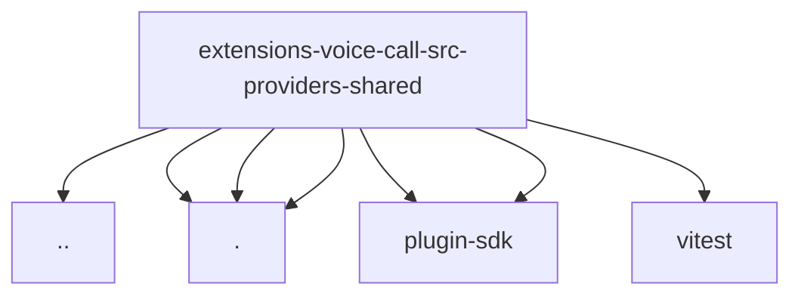

# Imports

[← Back to MODULE](MODULE.md) | [← Back to INDEX](../../INDEX.md)

## Dependency Graph

## External Dependencies

Dependencies from other modules:

- `../../../api.js`
- `./call-status.js`
- `./guarded-json-api.js`
- `./response-body.js`
- `openclaw/plugin-sdk/response-limit-runtime`
- `openclaw/plugin-sdk/string-coerce-runtime`
- `vitest`
