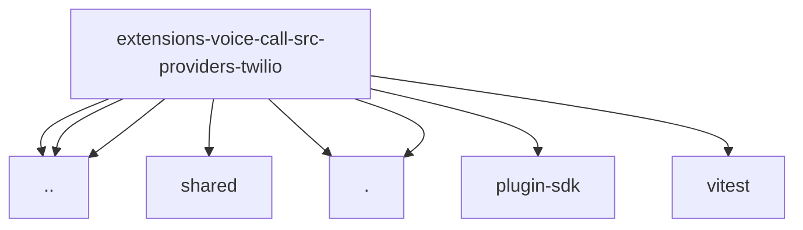

# Imports

[← Back to MODULE](MODULE.md) | [← Back to INDEX](../../INDEX.md)

## Dependency Graph

## External Dependencies

Dependencies from other modules:

- `../../../api.js`
- `../../webhook-security.js`
- `../shared/response-body.js`
- `../twilio-region.js`
- `./api.js`
- `./twiml-policy.js`
- `openclaw/plugin-sdk/string-coerce-runtime`
- `vitest`
