# Imports

[← Back to MODULE](MODULE.md) | [← Back to INDEX](../../INDEX.md)

## Dependency Graph

```mermaid
graph TD
    extensions_voice_call_src_providers[extensions-voice-call-src-providers] --> __[..]
    extensions_voice_call_src_providers[extensions-voice-call-src-providers] --> __[..]
    extensions_voice_call_src_providers[extensions-voice-call-src-providers] --> __[..]
    extensions_voice_call_src_providers[extensions-voice-call-src-providers] --> __[..]
    extensions_voice_call_src_providers[extensions-voice-call-src-providers] --> __[..]
    extensions_voice_call_src_providers[extensions-voice-call-src-providers] --> _[.]
    extensions_voice_call_src_providers[extensions-voice-call-src-providers] --> _[.]
    extensions_voice_call_src_providers[extensions-voice-call-src-providers] --> shared[shared]
    extensions_voice_call_src_providers[extensions-voice-call-src-providers] --> shared[shared]
    extensions_voice_call_src_providers[extensions-voice-call-src-providers] --> _[.]
    extensions_voice_call_src_providers[extensions-voice-call-src-providers] --> _[.]
    extensions_voice_call_src_providers[extensions-voice-call-src-providers] --> _[.]
    extensions_voice_call_src_providers[extensions-voice-call-src-providers] --> twilio[twilio]
    extensions_voice_call_src_providers[extensions-voice-call-src-providers] --> twilio[twilio]
    extensions_voice_call_src_providers[extensions-voice-call-src-providers] --> twilio[twilio]
    extensions_voice_call_src_providers[extensions-voice-call-src-providers] --> node_crypto[node:crypto]
    extensions_voice_call_src_providers[extensions-voice-call-src-providers] --> node_timers[node:timers]
    extensions_voice_call_src_providers[extensions-voice-call-src-providers] --> plugin_sdk[plugin-sdk]
    extensions_voice_call_src_providers[extensions-voice-call-src-providers] --> plugin_sdk[plugin-sdk]
    extensions_voice_call_src_providers[extensions-voice-call-src-providers] --> plugin_sdk[plugin-sdk]
    extensions_voice_call_src_providers[extensions-voice-call-src-providers] --> vitest[vitest]
```

## External Dependencies

Dependencies from other modules:

- `../http-headers.js`
- `../telephony-audio.js`
- `../voice-mapping.js`
- `../webhook-replay.js`
- `../webhook-security.js`
- `./mock.js`
- `./plivo.js`
- `./shared/call-status.js`
- `./shared/guarded-json-api.js`
- `./telnyx.js`
- `./twilio-region.js`
- `./twilio.js`
- `./twilio/api.js`
- `./twilio/twiml-policy.js`
- `./twilio/webhook.js`
- `node:crypto`
- `node:timers/promises`
- `openclaw/plugin-sdk/runtime-env`
- `openclaw/plugin-sdk/security-runtime`
- `openclaw/plugin-sdk/string-coerce-runtime`
- `vitest`
