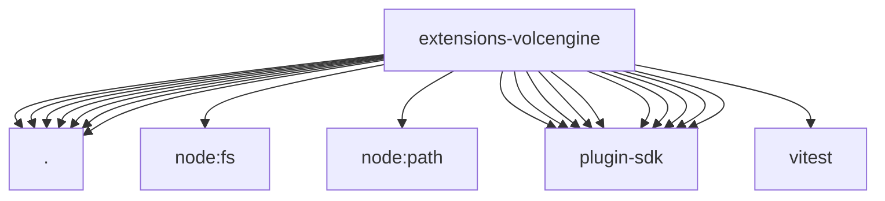

# Imports

[← Back to MODULE](MODULE.md) | [← Back to INDEX](../../INDEX.md)

## Dependency Graph

## External Dependencies

Dependencies from other modules:

- `./api.js`
- `./index.js`
- `./models.js`
- `./openclaw.plugin.json`
- `./provider-catalog.js`
- `./speech-provider.js`
- `./tts.js`
- `node:fs`
- `node:path`
- `openclaw/plugin-sdk/plugin-entry`
- `openclaw/plugin-sdk/plugin-test-runtime`
- `openclaw/plugin-sdk/provider-auth-api-key`
- `openclaw/plugin-sdk/provider-catalog-shared`
- `openclaw/plugin-sdk/provider-onboard`
- `openclaw/plugin-sdk/response-limit-runtime`
- `openclaw/plugin-sdk/secret-input`
- `openclaw/plugin-sdk/speech-core`
- `openclaw/plugin-sdk/ssrf-runtime`
- `openclaw/plugin-sdk/string-coerce-runtime`
- `vitest`
