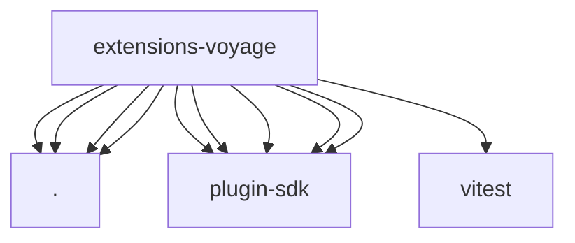

# Imports

[← Back to MODULE](MODULE.md) | [← Back to INDEX](../../INDEX.md)

## Dependency Graph

## External Dependencies

Dependencies from other modules:

- `./embedding-batch.js`
- `./embedding-provider.js`
- `./memory-embedding-adapter.js`
- `./test-support.js`
- `openclaw/plugin-sdk/memory-core-host-engine-embeddings`
- `openclaw/plugin-sdk/plugin-entry`
- `openclaw/plugin-sdk/provider-http`
- `openclaw/plugin-sdk/response-limit-runtime`
- `openclaw/plugin-sdk/string-coerce-runtime`
- `vitest`
