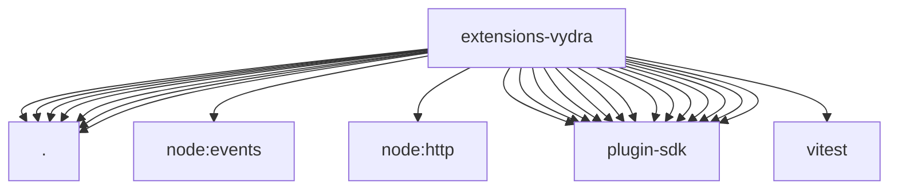

# Imports

[← Back to MODULE](MODULE.md) | [← Back to INDEX](../../INDEX.md)

## Dependency Graph

## External Dependencies

Dependencies from other modules:

- `./image-generation-provider.js`
- `./index.js`
- `./onboard.js`
- `./provider-test-helpers.test.js`
- `./shared.js`
- `./speech-provider.js`
- `./video-generation-provider.js`
- `node:events`
- `node:http`
- `openclaw/plugin-sdk/media-mime`
- `openclaw/plugin-sdk/plugin-entry`
- `openclaw/plugin-sdk/plugin-test-runtime`
- `openclaw/plugin-sdk/provider-auth`
- `openclaw/plugin-sdk/provider-auth-api-key`
- `openclaw/plugin-sdk/provider-auth-runtime`
- `openclaw/plugin-sdk/provider-http`
- `openclaw/plugin-sdk/provider-test-contracts`
- `openclaw/plugin-sdk/response-limit-runtime`
- `openclaw/plugin-sdk/secret-input`
- `openclaw/plugin-sdk/speech-core`
- `openclaw/plugin-sdk/string-coerce-runtime`
- `openclaw/plugin-sdk/test-live`
- `openclaw/plugin-sdk/test-media-understanding`
- `vitest`
