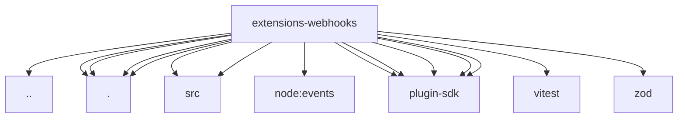

# Imports

[← Back to MODULE](MODULE.md) | [← Back to INDEX](../../INDEX.md)

## Dependency Graph

## External Dependencies

Dependencies from other modules:

- `../runtime-api.js`
- `./api.js`
- `./config.js`
- `./http.js`
- `./index.js`
- `./src/config.js`
- `./src/http.js`
- `node:events`
- `openclaw/plugin-sdk/plugin-test-api`
- `openclaw/plugin-sdk/plugin-test-runtime`
- `openclaw/plugin-sdk/security-runtime`
- `openclaw/plugin-sdk/string-coerce-runtime`
- `openclaw/plugin-sdk/test-env`
- `vitest`
- `zod`
