# Imports

[← Back to MODULE](MODULE.md) | [← Back to INDEX](../../INDEX.md)

## Dependency Graph

```mermaid
graph TD
    extensions_whatsapp_src_auto_reply_monitor[extensions-whatsapp-src-auto-reply-monitor] --> __[..]
    extensions_whatsapp_src_auto_reply_monitor[extensions-whatsapp-src-auto-reply-monitor] --> __[..]
    extensions_whatsapp_src_auto_reply_monitor[extensions-whatsapp-src-auto-reply-monitor] --> __[..]
    extensions_whatsapp_src_auto_reply_monitor[extensions-whatsapp-src-auto-reply-monitor] --> __[..]
    extensions_whatsapp_src_auto_reply_monitor[extensions-whatsapp-src-auto-reply-monitor] --> __[..]
    extensions_whatsapp_src_auto_reply_monitor[extensions-whatsapp-src-auto-reply-monitor] --> inbound[inbound]
    extensions_whatsapp_src_auto_reply_monitor[extensions-whatsapp-src-auto-reply-monitor] --> inbound[inbound]
    extensions_whatsapp_src_auto_reply_monitor[extensions-whatsapp-src-auto-reply-monitor] --> inbound[inbound]
    extensions_whatsapp_src_auto_reply_monitor[extensions-whatsapp-src-auto-reply-monitor] --> inbound[inbound]
    extensions_whatsapp_src_auto_reply_monitor[extensions-whatsapp-src-auto-reply-monitor] --> inbound[inbound]
    extensions_whatsapp_src_auto_reply_monitor[extensions-whatsapp-src-auto-reply-monitor] --> __[..]
    extensions_whatsapp_src_auto_reply_monitor[extensions-whatsapp-src-auto-reply-monitor] --> __[..]
    extensions_whatsapp_src_auto_reply_monitor[extensions-whatsapp-src-auto-reply-monitor] --> __[..]
    extensions_whatsapp_src_auto_reply_monitor[extensions-whatsapp-src-auto-reply-monitor] --> __[..]
    extensions_whatsapp_src_auto_reply_monitor[extensions-whatsapp-src-auto-reply-monitor] --> __[..]
    extensions_whatsapp_src_auto_reply_monitor[extensions-whatsapp-src-auto-reply-monitor] --> __[..]
    extensions_whatsapp_src_auto_reply_monitor[extensions-whatsapp-src-auto-reply-monitor] --> __[..]
    extensions_whatsapp_src_auto_reply_monitor[extensions-whatsapp-src-auto-reply-monitor] --> __[..]
    extensions_whatsapp_src_auto_reply_monitor[extensions-whatsapp-src-auto-reply-monitor] --> __[..]
    extensions_whatsapp_src_auto_reply_monitor[extensions-whatsapp-src-auto-reply-monitor] --> __[..]
    extensions_whatsapp_src_auto_reply_monitor[extensions-whatsapp-src-auto-reply-monitor] --> __[..]
    extensions_whatsapp_src_auto_reply_monitor[extensions-whatsapp-src-auto-reply-monitor] --> __[..]
    extensions_whatsapp_src_auto_reply_monitor[extensions-whatsapp-src-auto-reply-monitor] --> _[.]
    extensions_whatsapp_src_auto_reply_monitor[extensions-whatsapp-src-auto-reply-monitor] --> _[.]
    extensions_whatsapp_src_auto_reply_monitor[extensions-whatsapp-src-auto-reply-monitor] --> _[.]
    extensions_whatsapp_src_auto_reply_monitor[extensions-whatsapp-src-auto-reply-monitor] --> _[.]
    extensions_whatsapp_src_auto_reply_monitor[extensions-whatsapp-src-auto-reply-monitor] --> _[.]
    extensions_whatsapp_src_auto_reply_monitor[extensions-whatsapp-src-auto-reply-monitor] --> _[.]
    extensions_whatsapp_src_auto_reply_monitor[extensions-whatsapp-src-auto-reply-monitor] --> _[.]
    extensions_whatsapp_src_auto_reply_monitor[extensions-whatsapp-src-auto-reply-monitor] --> _[.]
    extensions_whatsapp_src_auto_reply_monitor[extensions-whatsapp-src-auto-reply-monitor] --> _[.]
    extensions_whatsapp_src_auto_reply_monitor[extensions-whatsapp-src-auto-reply-monitor] --> _[.]
    extensions_whatsapp_src_auto_reply_monitor[extensions-whatsapp-src-auto-reply-monitor] --> _[.]
    extensions_whatsapp_src_auto_reply_monitor[extensions-whatsapp-src-auto-reply-monitor] --> _[.]
    extensions_whatsapp_src_auto_reply_monitor[extensions-whatsapp-src-auto-reply-monitor] --> _[.]
    extensions_whatsapp_src_auto_reply_monitor[extensions-whatsapp-src-auto-reply-monitor] --> _[.]
    extensions_whatsapp_src_auto_reply_monitor[extensions-whatsapp-src-auto-reply-monitor] --> _[.]
    extensions_whatsapp_src_auto_reply_monitor[extensions-whatsapp-src-auto-reply-monitor] --> _[.]
    extensions_whatsapp_src_auto_reply_monitor[extensions-whatsapp-src-auto-reply-monitor] --> _[.]
    extensions_whatsapp_src_auto_reply_monitor[extensions-whatsapp-src-auto-reply-monitor] --> _[.]
    extensions_whatsapp_src_auto_reply_monitor[extensions-whatsapp-src-auto-reply-monitor] --> _[.]
    extensions_whatsapp_src_auto_reply_monitor[extensions-whatsapp-src-auto-reply-monitor] --> _[.]
    extensions_whatsapp_src_auto_reply_monitor[extensions-whatsapp-src-auto-reply-monitor] --> _[.]
    extensions_whatsapp_src_auto_reply_monitor[extensions-whatsapp-src-auto-reply-monitor] --> _[.]
    extensions_whatsapp_src_auto_reply_monitor[extensions-whatsapp-src-auto-reply-monitor] --> node_fs[node:fs]
    extensions_whatsapp_src_auto_reply_monitor[extensions-whatsapp-src-auto-reply-monitor] --> node_os[node:os]
    extensions_whatsapp_src_auto_reply_monitor[extensions-whatsapp-src-auto-reply-monitor] --> node_path[node:path]
    extensions_whatsapp_src_auto_reply_monitor[extensions-whatsapp-src-auto-reply-monitor] --> plugin_sdk[plugin-sdk]
    extensions_whatsapp_src_auto_reply_monitor[extensions-whatsapp-src-auto-reply-monitor] --> plugin_sdk[plugin-sdk]
    extensions_whatsapp_src_auto_reply_monitor[extensions-whatsapp-src-auto-reply-monitor] --> plugin_sdk[plugin-sdk]
    extensions_whatsapp_src_auto_reply_monitor[extensions-whatsapp-src-auto-reply-monitor] --> plugin_sdk[plugin-sdk]
    extensions_whatsapp_src_auto_reply_monitor[extensions-whatsapp-src-auto-reply-monitor] --> plugin_sdk[plugin-sdk]
    extensions_whatsapp_src_auto_reply_monitor[extensions-whatsapp-src-auto-reply-monitor] --> plugin_sdk[plugin-sdk]
    extensions_whatsapp_src_auto_reply_monitor[extensions-whatsapp-src-auto-reply-monitor] --> plugin_sdk[plugin-sdk]
    extensions_whatsapp_src_auto_reply_monitor[extensions-whatsapp-src-auto-reply-monitor] --> plugin_sdk[plugin-sdk]
    extensions_whatsapp_src_auto_reply_monitor[extensions-whatsapp-src-auto-reply-monitor] --> plugin_sdk[plugin-sdk]
    extensions_whatsapp_src_auto_reply_monitor[extensions-whatsapp-src-auto-reply-monitor] --> plugin_sdk[plugin-sdk]
    extensions_whatsapp_src_auto_reply_monitor[extensions-whatsapp-src-auto-reply-monitor] --> plugin_sdk[plugin-sdk]
    extensions_whatsapp_src_auto_reply_monitor[extensions-whatsapp-src-auto-reply-monitor] --> plugin_sdk[plugin-sdk]
    extensions_whatsapp_src_auto_reply_monitor[extensions-whatsapp-src-auto-reply-monitor] --> plugin_sdk[plugin-sdk]
    extensions_whatsapp_src_auto_reply_monitor[extensions-whatsapp-src-auto-reply-monitor] --> plugin_sdk[plugin-sdk]
    extensions_whatsapp_src_auto_reply_monitor[extensions-whatsapp-src-auto-reply-monitor] --> plugin_sdk[plugin-sdk]
    extensions_whatsapp_src_auto_reply_monitor[extensions-whatsapp-src-auto-reply-monitor] --> plugin_sdk[plugin-sdk]
    extensions_whatsapp_src_auto_reply_monitor[extensions-whatsapp-src-auto-reply-monitor] --> plugin_sdk[plugin-sdk]
    extensions_whatsapp_src_auto_reply_monitor[extensions-whatsapp-src-auto-reply-monitor] --> plugin_sdk[plugin-sdk]
    extensions_whatsapp_src_auto_reply_monitor[extensions-whatsapp-src-auto-reply-monitor] --> vitest[vitest]
```

## External Dependencies

Dependencies from other modules:

- `../../accounts.js`
- `../../group-config-path.js`
- `../../group-session-key.js`
- `../../identity.js`
- `../../inbound-policy.js`
- `../../inbound/admission.js`
- `../../inbound/ingress-lifecycle.js`
- `../../inbound/message-aliases.js`
- `../../inbound/send-result.test-helper.js`
- `../../inbound/test-message.test-helper.js`
- `../../outbound-media-contract.js`
- `../../reaction-level.js`
- `../../reconnect.js`
- `../../send.js`
- `../../session.js`
- `../../system-prompt.js`
- `../../text-runtime.js`
- `../config.runtime.js`
- `../deliver-reply.js`
- `../loggers.js`
- `../mentions.js`
- `../util.js`
- `./ack-emoji.js`
- `./ack-reaction.js`
- `./broadcast.js`
- `./commands.js`
- `./echo.js`
- `./group-activation.js`
- `./group-activation.runtime.js`
- `./group-gating.js`
- `./group-gating.runtime.js`
- `./group-members.js`
- `./inbound-context.js`
- `./inbound-dispatch.js`
- `./inbound-dispatch.runtime.js`
- `./last-route.js`
- `./message-line.js`
- `./message-line.runtime.js`
- `./on-message.js`
- `./peer.js`
- `./process-message.js`
- `./reaction-participant.js`
- `./runtime-api.js`
- `./status-reaction.js`
- `node:fs/promises`
- `node:os`
- `node:path`
- `openclaw/plugin-sdk/agent-runtime`
- `openclaw/plugin-sdk/channel-feedback`
- `openclaw/plugin-sdk/channel-inbound`
- `openclaw/plugin-sdk/channel-outbound`
- `openclaw/plugin-sdk/conversation-binding-runtime`
- `openclaw/plugin-sdk/dedupe-runtime`
- `openclaw/plugin-sdk/hook-runtime`
- `openclaw/plugin-sdk/media-runtime`
- `openclaw/plugin-sdk/plugin-runtime`
- `openclaw/plugin-sdk/reply-history`
- `openclaw/plugin-sdk/reply-reference`
- `openclaw/plugin-sdk/routing`
- `openclaw/plugin-sdk/runtime-env`
- `openclaw/plugin-sdk/security-runtime`
- `openclaw/plugin-sdk/session-store-runtime`
- `openclaw/plugin-sdk/sqlite-runtime-testing`
- `openclaw/plugin-sdk/string-coerce-runtime`
- `openclaw/plugin-sdk/text-utility-runtime`
- `vitest`
