# Imports

[← Back to MODULE](MODULE.md) | [← Back to INDEX](../../INDEX.md)

## Dependency Graph

```mermaid
graph TD
    extensions_whatsapp_src_auto_reply[extensions-whatsapp-src-auto-reply] --> __[..]
    extensions_whatsapp_src_auto_reply[extensions-whatsapp-src-auto-reply] --> __[..]
    extensions_whatsapp_src_auto_reply[extensions-whatsapp-src-auto-reply] --> __[..]
    extensions_whatsapp_src_auto_reply[extensions-whatsapp-src-auto-reply] --> __[..]
    extensions_whatsapp_src_auto_reply[extensions-whatsapp-src-auto-reply] --> __[..]
    extensions_whatsapp_src_auto_reply[extensions-whatsapp-src-auto-reply] --> inbound[inbound]
    extensions_whatsapp_src_auto_reply[extensions-whatsapp-src-auto-reply] --> inbound[inbound]
    extensions_whatsapp_src_auto_reply[extensions-whatsapp-src-auto-reply] --> inbound[inbound]
    extensions_whatsapp_src_auto_reply[extensions-whatsapp-src-auto-reply] --> inbound[inbound]
    extensions_whatsapp_src_auto_reply[extensions-whatsapp-src-auto-reply] --> inbound[inbound]
    extensions_whatsapp_src_auto_reply[extensions-whatsapp-src-auto-reply] --> inbound[inbound]
    extensions_whatsapp_src_auto_reply[extensions-whatsapp-src-auto-reply] --> __[..]
    extensions_whatsapp_src_auto_reply[extensions-whatsapp-src-auto-reply] --> __[..]
    extensions_whatsapp_src_auto_reply[extensions-whatsapp-src-auto-reply] --> __[..]
    extensions_whatsapp_src_auto_reply[extensions-whatsapp-src-auto-reply] --> __[..]
    extensions_whatsapp_src_auto_reply[extensions-whatsapp-src-auto-reply] --> __[..]
    extensions_whatsapp_src_auto_reply[extensions-whatsapp-src-auto-reply] --> __[..]
    extensions_whatsapp_src_auto_reply[extensions-whatsapp-src-auto-reply] --> __[..]
    extensions_whatsapp_src_auto_reply[extensions-whatsapp-src-auto-reply] --> __[..]
    extensions_whatsapp_src_auto_reply[extensions-whatsapp-src-auto-reply] --> _[.]
    extensions_whatsapp_src_auto_reply[extensions-whatsapp-src-auto-reply] --> _[.]
    extensions_whatsapp_src_auto_reply[extensions-whatsapp-src-auto-reply] --> _[.]
    extensions_whatsapp_src_auto_reply[extensions-whatsapp-src-auto-reply] --> _[.]
    extensions_whatsapp_src_auto_reply[extensions-whatsapp-src-auto-reply] --> monitor[monitor]
    extensions_whatsapp_src_auto_reply[extensions-whatsapp-src-auto-reply] --> monitor[monitor]
    extensions_whatsapp_src_auto_reply[extensions-whatsapp-src-auto-reply] --> monitor[monitor]
    extensions_whatsapp_src_auto_reply[extensions-whatsapp-src-auto-reply] --> monitor[monitor]
    extensions_whatsapp_src_auto_reply[extensions-whatsapp-src-auto-reply] --> monitor[monitor]
    extensions_whatsapp_src_auto_reply[extensions-whatsapp-src-auto-reply] --> _[.]
    extensions_whatsapp_src_auto_reply[extensions-whatsapp-src-auto-reply] --> node_fs[node:fs]
    extensions_whatsapp_src_auto_reply[extensions-whatsapp-src-auto-reply] --> node_os[node:os]
    extensions_whatsapp_src_auto_reply[extensions-whatsapp-src-auto-reply] --> node_path[node:path]
    extensions_whatsapp_src_auto_reply[extensions-whatsapp-src-auto-reply] --> plugin_sdk[plugin-sdk]
    extensions_whatsapp_src_auto_reply[extensions-whatsapp-src-auto-reply] --> plugin_sdk[plugin-sdk]
    extensions_whatsapp_src_auto_reply[extensions-whatsapp-src-auto-reply] --> plugin_sdk[plugin-sdk]
    extensions_whatsapp_src_auto_reply[extensions-whatsapp-src-auto-reply] --> plugin_sdk[plugin-sdk]
    extensions_whatsapp_src_auto_reply[extensions-whatsapp-src-auto-reply] --> plugin_sdk[plugin-sdk]
    extensions_whatsapp_src_auto_reply[extensions-whatsapp-src-auto-reply] --> plugin_sdk[plugin-sdk]
    extensions_whatsapp_src_auto_reply[extensions-whatsapp-src-auto-reply] --> plugin_sdk[plugin-sdk]
    extensions_whatsapp_src_auto_reply[extensions-whatsapp-src-auto-reply] --> plugin_sdk[plugin-sdk]
    extensions_whatsapp_src_auto_reply[extensions-whatsapp-src-auto-reply] --> plugin_sdk[plugin-sdk]
    extensions_whatsapp_src_auto_reply[extensions-whatsapp-src-auto-reply] --> plugin_sdk[plugin-sdk]
    extensions_whatsapp_src_auto_reply[extensions-whatsapp-src-auto-reply] --> plugin_sdk[plugin-sdk]
    extensions_whatsapp_src_auto_reply[extensions-whatsapp-src-auto-reply] --> plugin_sdk[plugin-sdk]
    extensions_whatsapp_src_auto_reply[extensions-whatsapp-src-auto-reply] --> plugin_sdk[plugin-sdk]
    extensions_whatsapp_src_auto_reply[extensions-whatsapp-src-auto-reply] --> plugin_sdk[plugin-sdk]
    extensions_whatsapp_src_auto_reply[extensions-whatsapp-src-auto-reply] --> plugin_sdk[plugin-sdk]
    extensions_whatsapp_src_auto_reply[extensions-whatsapp-src-auto-reply] --> plugin_sdk[plugin-sdk]
    extensions_whatsapp_src_auto_reply[extensions-whatsapp-src-auto-reply] --> plugin_sdk[plugin-sdk]
    extensions_whatsapp_src_auto_reply[extensions-whatsapp-src-auto-reply] --> plugin_sdk[plugin-sdk]
    extensions_whatsapp_src_auto_reply[extensions-whatsapp-src-auto-reply] --> plugin_sdk[plugin-sdk]
    extensions_whatsapp_src_auto_reply[extensions-whatsapp-src-auto-reply] --> plugin_sdk[plugin-sdk]
    extensions_whatsapp_src_auto_reply[extensions-whatsapp-src-auto-reply] --> plugin_sdk[plugin-sdk]
    extensions_whatsapp_src_auto_reply[extensions-whatsapp-src-auto-reply] --> plugin_sdk[plugin-sdk]
    extensions_whatsapp_src_auto_reply[extensions-whatsapp-src-auto-reply] --> vitest[vitest]
```

## External Dependencies

Dependencies from other modules:

- `../accounts.js`
- `../auth-store.js`
- `../connection-controller.js`
- `../identity.js`
- `../inbound-policy.js`
- `../inbound/admission.js`
- `../inbound/message-aliases.js`
- `../inbound/monitor.js`
- `../inbound/send-result.js`
- `../inbound/send-result.test-helper.js`
- `../inbound/test-message.test-helper.js`
- `../media.js`
- `../outbound-media-contract.js`
- `../outbound-retry.js`
- `../quoted-message.js`
- `../reconnect.js`
- `../session.js`
- `../socket-timing.js`
- `../text-runtime.js`
- `./config.runtime.js`
- `./loggers.js`
- `./mentions.js`
- `./monitor-state.js`
- `./monitor/echo.js`
- `./monitor/group-gating.js`
- `./monitor/listener-log.js`
- `./monitor/message-line.js`
- `./monitor/on-message.js`
- `./util.js`
- `node:fs/promises`
- `node:os`
- `node:path`
- `openclaw/plugin-sdk/account-core`
- `openclaw/plugin-sdk/approval-handler-runtime`
- `openclaw/plugin-sdk/channel-inbound`
- `openclaw/plugin-sdk/channel-inbound-debounce`
- `openclaw/plugin-sdk/channel-mention-gating`
- `openclaw/plugin-sdk/channel-outbound`
- `openclaw/plugin-sdk/channel-runtime-context`
- `openclaw/plugin-sdk/cli-runtime`
- `openclaw/plugin-sdk/delivery-queue-runtime`
- `openclaw/plugin-sdk/gateway-runtime`
- `openclaw/plugin-sdk/lazy-runtime`
- `openclaw/plugin-sdk/media-runtime`
- `openclaw/plugin-sdk/reply-chunking`
- `openclaw/plugin-sdk/reply-history`
- `openclaw/plugin-sdk/reply-payload`
- `openclaw/plugin-sdk/routing`
- `openclaw/plugin-sdk/runtime-env`
- `openclaw/plugin-sdk/session-store-runtime`
- `openclaw/plugin-sdk/string-coerce-runtime`
- `openclaw/plugin-sdk/system-event-runtime`
- `openclaw/plugin-sdk/test-env`
- `openclaw/plugin-sdk/text-utility-runtime`
- `vitest`
