# Imports

[← Back to MODULE](MODULE.md) | [← Back to INDEX](../../INDEX.md)

## Dependency Graph

```mermaid
graph TD
    extensions_whatsapp_src_inbound[extensions-whatsapp-src-inbound] --> mocks[mocks]
    extensions_whatsapp_src_inbound[extensions-whatsapp-src-inbound] --> __[..]
    extensions_whatsapp_src_inbound[extensions-whatsapp-src-inbound] --> __[..]
    extensions_whatsapp_src_inbound[extensions-whatsapp-src-inbound] --> __[..]
    extensions_whatsapp_src_inbound[extensions-whatsapp-src-inbound] --> __[..]
    extensions_whatsapp_src_inbound[extensions-whatsapp-src-inbound] --> __[..]
    extensions_whatsapp_src_inbound[extensions-whatsapp-src-inbound] --> __[..]
    extensions_whatsapp_src_inbound[extensions-whatsapp-src-inbound] --> __[..]
    extensions_whatsapp_src_inbound[extensions-whatsapp-src-inbound] --> __[..]
    extensions_whatsapp_src_inbound[extensions-whatsapp-src-inbound] --> __[..]
    extensions_whatsapp_src_inbound[extensions-whatsapp-src-inbound] --> __[..]
    extensions_whatsapp_src_inbound[extensions-whatsapp-src-inbound] --> __[..]
    extensions_whatsapp_src_inbound[extensions-whatsapp-src-inbound] --> __[..]
    extensions_whatsapp_src_inbound[extensions-whatsapp-src-inbound] --> __[..]
    extensions_whatsapp_src_inbound[extensions-whatsapp-src-inbound] --> __[..]
    extensions_whatsapp_src_inbound[extensions-whatsapp-src-inbound] --> __[..]
    extensions_whatsapp_src_inbound[extensions-whatsapp-src-inbound] --> __[..]
    extensions_whatsapp_src_inbound[extensions-whatsapp-src-inbound] --> __[..]
    extensions_whatsapp_src_inbound[extensions-whatsapp-src-inbound] --> __[..]
    extensions_whatsapp_src_inbound[extensions-whatsapp-src-inbound] --> _[.]
    extensions_whatsapp_src_inbound[extensions-whatsapp-src-inbound] --> _[.]
    extensions_whatsapp_src_inbound[extensions-whatsapp-src-inbound] --> _[.]
    extensions_whatsapp_src_inbound[extensions-whatsapp-src-inbound] --> _[.]
    extensions_whatsapp_src_inbound[extensions-whatsapp-src-inbound] --> _[.]
    extensions_whatsapp_src_inbound[extensions-whatsapp-src-inbound] --> _[.]
    extensions_whatsapp_src_inbound[extensions-whatsapp-src-inbound] --> _[.]
    extensions_whatsapp_src_inbound[extensions-whatsapp-src-inbound] --> _[.]
    extensions_whatsapp_src_inbound[extensions-whatsapp-src-inbound] --> _[.]
    extensions_whatsapp_src_inbound[extensions-whatsapp-src-inbound] --> _[.]
    extensions_whatsapp_src_inbound[extensions-whatsapp-src-inbound] --> _[.]
    extensions_whatsapp_src_inbound[extensions-whatsapp-src-inbound] --> _[.]
    extensions_whatsapp_src_inbound[extensions-whatsapp-src-inbound] --> _[.]
    extensions_whatsapp_src_inbound[extensions-whatsapp-src-inbound] --> _[.]
    extensions_whatsapp_src_inbound[extensions-whatsapp-src-inbound] --> _[.]
    extensions_whatsapp_src_inbound[extensions-whatsapp-src-inbound] --> _[.]
    extensions_whatsapp_src_inbound[extensions-whatsapp-src-inbound] --> _[.]
    extensions_whatsapp_src_inbound[extensions-whatsapp-src-inbound] --> _[.]
    extensions_whatsapp_src_inbound[extensions-whatsapp-src-inbound] --> _[.]
    extensions_whatsapp_src_inbound[extensions-whatsapp-src-inbound] --> baileys[baileys]
    extensions_whatsapp_src_inbound[extensions-whatsapp-src-inbound] --> node_crypto[node:crypto]
    extensions_whatsapp_src_inbound[extensions-whatsapp-src-inbound] --> node_fs[node:fs]
    extensions_whatsapp_src_inbound[extensions-whatsapp-src-inbound] --> node_fs[node:fs]
    extensions_whatsapp_src_inbound[extensions-whatsapp-src-inbound] --> node_os[node:os]
    extensions_whatsapp_src_inbound[extensions-whatsapp-src-inbound] --> node_path[node:path]
    extensions_whatsapp_src_inbound[extensions-whatsapp-src-inbound] --> node_stream[node:stream]
    extensions_whatsapp_src_inbound[extensions-whatsapp-src-inbound] --> plugin_sdk[plugin-sdk]
    extensions_whatsapp_src_inbound[extensions-whatsapp-src-inbound] --> plugin_sdk[plugin-sdk]
    extensions_whatsapp_src_inbound[extensions-whatsapp-src-inbound] --> plugin_sdk[plugin-sdk]
    extensions_whatsapp_src_inbound[extensions-whatsapp-src-inbound] --> plugin_sdk[plugin-sdk]
    extensions_whatsapp_src_inbound[extensions-whatsapp-src-inbound] --> plugin_sdk[plugin-sdk]
    extensions_whatsapp_src_inbound[extensions-whatsapp-src-inbound] --> plugin_sdk[plugin-sdk]
    extensions_whatsapp_src_inbound[extensions-whatsapp-src-inbound] --> plugin_sdk[plugin-sdk]
    extensions_whatsapp_src_inbound[extensions-whatsapp-src-inbound] --> plugin_sdk[plugin-sdk]
    extensions_whatsapp_src_inbound[extensions-whatsapp-src-inbound] --> plugin_sdk[plugin-sdk]
    extensions_whatsapp_src_inbound[extensions-whatsapp-src-inbound] --> plugin_sdk[plugin-sdk]
    extensions_whatsapp_src_inbound[extensions-whatsapp-src-inbound] --> plugin_sdk[plugin-sdk]
    extensions_whatsapp_src_inbound[extensions-whatsapp-src-inbound] --> plugin_sdk[plugin-sdk]
    extensions_whatsapp_src_inbound[extensions-whatsapp-src-inbound] --> plugin_sdk[plugin-sdk]
    extensions_whatsapp_src_inbound[extensions-whatsapp-src-inbound] --> plugin_sdk[plugin-sdk]
    extensions_whatsapp_src_inbound[extensions-whatsapp-src-inbound] --> plugin_sdk[plugin-sdk]
    extensions_whatsapp_src_inbound[extensions-whatsapp-src-inbound] --> vitest[vitest]
```

## External Dependencies

Dependencies from other modules:

- `../../../../test/mocks/baileys.js`
- `../approval-reactions.js`
- `../auth-store.js`
- `../connection-controller-runtime-context.js`
- `../document-filename.js`
- `../identity.js`
- `../image-preview.js`
- `../inbound-policy.js`
- `../normalize.js`
- `../pairing-security.test-harness.js`
- `../question-reactions.js`
- `../quoted-message.js`
- `../reconnect.js`
- `../runtime.js`
- `../session.js`
- `../session.runtime.js`
- `../socket-timing.js`
- `../text-runtime.js`
- `../vcard.js`
- `./access-control.js`
- `./access-control.test-harness.js`
- `./admission.js`
- `./dedupe.js`
- `./durable-payload.js`
- `./durable-receive.js`
- `./extract.js`
- `./group-conversation.js`
- `./ingress-lifecycle.js`
- `./lifecycle.js`
- `./media-mimetype.js`
- `./media.js`
- `./message-aliases.js`
- `./outbound-mentions.js`
- `./runtime-api.js`
- `./send-api.js`
- `./send-result.js`
- `./send-result.test-helper.js`
- `./test-message.test-helper.js`
- `baileys`
- `node:crypto`
- `node:fs`
- `node:fs/promises`
- `node:os`
- `node:path`
- `node:stream`
- `openclaw/plugin-sdk/channel-activity-runtime`
- `openclaw/plugin-sdk/channel-inbound`
- `openclaw/plugin-sdk/channel-inbound-debounce`
- `openclaw/plugin-sdk/channel-outbound`
- `openclaw/plugin-sdk/channel-pairing`
- `openclaw/plugin-sdk/conversation-runtime`
- `openclaw/plugin-sdk/dedupe-runtime`
- `openclaw/plugin-sdk/logging-core`
- `openclaw/plugin-sdk/media-store`
- `openclaw/plugin-sdk/number-runtime`
- `openclaw/plugin-sdk/plugin-state-test-runtime`
- `openclaw/plugin-sdk/runtime-env`
- `openclaw/plugin-sdk/runtime-group-policy`
- `openclaw/plugin-sdk/session-store-runtime`
- `openclaw/plugin-sdk/string-coerce-runtime`
- `vitest`
