# Imports

[← Back to MODULE](MODULE.md) | [← Back to INDEX](../../INDEX.md)

## Dependency Graph

```mermaid
graph TD
    extensions_whatsapp[extensions-whatsapp] --> mocks[mocks]
    extensions_whatsapp[extensions-whatsapp] --> __[..]
    extensions_whatsapp[extensions-whatsapp] --> __[..]
    extensions_whatsapp[extensions-whatsapp] --> __[..]
    extensions_whatsapp[extensions-whatsapp] --> __[..]
    extensions_whatsapp[extensions-whatsapp] --> _[.]
    extensions_whatsapp[extensions-whatsapp] --> _[.]
    extensions_whatsapp[extensions-whatsapp] --> _[.]
    extensions_whatsapp[extensions-whatsapp] --> _[.]
    extensions_whatsapp[extensions-whatsapp] --> _[.]
    extensions_whatsapp[extensions-whatsapp] --> _[.]
    extensions_whatsapp[extensions-whatsapp] --> _[.]
    extensions_whatsapp[extensions-whatsapp] --> _[.]
    extensions_whatsapp[extensions-whatsapp] --> _[.]
    extensions_whatsapp[extensions-whatsapp] --> _[.]
    extensions_whatsapp[extensions-whatsapp] --> _[.]
    extensions_whatsapp[extensions-whatsapp] --> _[.]
    extensions_whatsapp[extensions-whatsapp] --> _[.]
    extensions_whatsapp[extensions-whatsapp] --> _[.]
    extensions_whatsapp[extensions-whatsapp] --> _[.]
    extensions_whatsapp[extensions-whatsapp] --> _[.]
    extensions_whatsapp[extensions-whatsapp] --> auto_reply[auto-reply]
    extensions_whatsapp[extensions-whatsapp] --> auto_reply[auto-reply]
    extensions_whatsapp[extensions-whatsapp] --> monitor[monitor]
    extensions_whatsapp[extensions-whatsapp] --> monitor[monitor]
    extensions_whatsapp[extensions-whatsapp] --> _[.]
    extensions_whatsapp[extensions-whatsapp] --> _[.]
    extensions_whatsapp[extensions-whatsapp] --> _[.]
    extensions_whatsapp[extensions-whatsapp] --> _[.]
    extensions_whatsapp[extensions-whatsapp] --> _[.]
    extensions_whatsapp[extensions-whatsapp] --> _[.]
    extensions_whatsapp[extensions-whatsapp] --> _[.]
    extensions_whatsapp[extensions-whatsapp] --> _[.]
    extensions_whatsapp[extensions-whatsapp] --> _[.]
    extensions_whatsapp[extensions-whatsapp] --> _[.]
    extensions_whatsapp[extensions-whatsapp] --> _[.]
    extensions_whatsapp[extensions-whatsapp] --> _[.]
    extensions_whatsapp[extensions-whatsapp] --> _[.]
    extensions_whatsapp[extensions-whatsapp] --> _[.]
    extensions_whatsapp[extensions-whatsapp] --> _[.]
    extensions_whatsapp[extensions-whatsapp] --> _[.]
    extensions_whatsapp[extensions-whatsapp] --> _[.]
    extensions_whatsapp[extensions-whatsapp] --> _[.]
    extensions_whatsapp[extensions-whatsapp] --> _[.]
    extensions_whatsapp[extensions-whatsapp] --> _[.]
    extensions_whatsapp[extensions-whatsapp] --> _[.]
    extensions_whatsapp[extensions-whatsapp] --> _[.]
    extensions_whatsapp[extensions-whatsapp] --> _[.]
    extensions_whatsapp[extensions-whatsapp] --> _[.]
    extensions_whatsapp[extensions-whatsapp] --> _[.]
    extensions_whatsapp[extensions-whatsapp] --> _[.]
    extensions_whatsapp[extensions-whatsapp] --> _[.]
    extensions_whatsapp[extensions-whatsapp] --> _[.]
    extensions_whatsapp[extensions-whatsapp] --> _[.]
    extensions_whatsapp[extensions-whatsapp] --> _[.]
    extensions_whatsapp[extensions-whatsapp] --> inbound[inbound]
    extensions_whatsapp[extensions-whatsapp] --> inbound[inbound]
    extensions_whatsapp[extensions-whatsapp] --> inbound[inbound]
    extensions_whatsapp[extensions-whatsapp] --> inbound[inbound]
    extensions_whatsapp[extensions-whatsapp] --> inbound[inbound]
    extensions_whatsapp[extensions-whatsapp] --> inbound[inbound]
    extensions_whatsapp[extensions-whatsapp] --> inbound[inbound]
    extensions_whatsapp[extensions-whatsapp] --> inbound[inbound]
    extensions_whatsapp[extensions-whatsapp] --> inbound[inbound]
    extensions_whatsapp[extensions-whatsapp] --> inbound[inbound]
    extensions_whatsapp[extensions-whatsapp] --> inbound[inbound]
    extensions_whatsapp[extensions-whatsapp] --> _[.]
    extensions_whatsapp[extensions-whatsapp] --> _[.]
    extensions_whatsapp[extensions-whatsapp] --> _[.]
    extensions_whatsapp[extensions-whatsapp] --> _[.]
    extensions_whatsapp[extensions-whatsapp] --> _[.]
    extensions_whatsapp[extensions-whatsapp] --> _[.]
    extensions_whatsapp[extensions-whatsapp] --> _[.]
    extensions_whatsapp[extensions-whatsapp] --> _[.]
    extensions_whatsapp[extensions-whatsapp] --> _[.]
    extensions_whatsapp[extensions-whatsapp] --> _[.]
    extensions_whatsapp[extensions-whatsapp] --> _[.]
    extensions_whatsapp[extensions-whatsapp] --> _[.]
    extensions_whatsapp[extensions-whatsapp] --> _[.]
    extensions_whatsapp[extensions-whatsapp] --> _[.]
    extensions_whatsapp[extensions-whatsapp] --> _[.]
    extensions_whatsapp[extensions-whatsapp] --> _[.]
    extensions_whatsapp[extensions-whatsapp] --> _[.]
    extensions_whatsapp[extensions-whatsapp] --> _[.]
    extensions_whatsapp[extensions-whatsapp] --> _[.]
    extensions_whatsapp[extensions-whatsapp] --> _[.]
    extensions_whatsapp[extensions-whatsapp] --> _[.]
    extensions_whatsapp[extensions-whatsapp] --> _[.]
    extensions_whatsapp[extensions-whatsapp] --> _[.]
    extensions_whatsapp[extensions-whatsapp] --> _[.]
    extensions_whatsapp[extensions-whatsapp] --> _[.]
    extensions_whatsapp[extensions-whatsapp] --> _[.]
    extensions_whatsapp[extensions-whatsapp] --> _[.]
    extensions_whatsapp[extensions-whatsapp] --> _[.]
    extensions_whatsapp[extensions-whatsapp] --> _[.]
    extensions_whatsapp[extensions-whatsapp] --> _[.]
    extensions_whatsapp[extensions-whatsapp] --> _[.]
    extensions_whatsapp[extensions-whatsapp] --> _[.]
    extensions_whatsapp[extensions-whatsapp] --> _[.]
    extensions_whatsapp[extensions-whatsapp] --> _[.]
    extensions_whatsapp[extensions-whatsapp] --> _[.]
    extensions_whatsapp[extensions-whatsapp] --> _[.]
    extensions_whatsapp[extensions-whatsapp] --> _[.]
    extensions_whatsapp[extensions-whatsapp] --> _[.]
    extensions_whatsapp[extensions-whatsapp] --> _[.]
    extensions_whatsapp[extensions-whatsapp] --> _[.]
    extensions_whatsapp[extensions-whatsapp] --> _[.]
    extensions_whatsapp[extensions-whatsapp] --> _[.]
    extensions_whatsapp[extensions-whatsapp] --> _[.]
    extensions_whatsapp[extensions-whatsapp] --> _[.]
    extensions_whatsapp[extensions-whatsapp] --> _[.]
    extensions_whatsapp[extensions-whatsapp] --> src[src]
    extensions_whatsapp[extensions-whatsapp] --> src[src]
    extensions_whatsapp[extensions-whatsapp] --> src[src]
    extensions_whatsapp[extensions-whatsapp] --> src[src]
    extensions_whatsapp[extensions-whatsapp] --> inbound[inbound]
    extensions_whatsapp[extensions-whatsapp] --> src[src]
    extensions_whatsapp[extensions-whatsapp] --> src[src]
    extensions_whatsapp[extensions-whatsapp] --> src[src]
    extensions_whatsapp[extensions-whatsapp] --> _[.]
    extensions_whatsapp[extensions-whatsapp] --> _[.]
    extensions_whatsapp[extensions-whatsapp] --> _[.]
    extensions_whatsapp[extensions-whatsapp] --> _[.]
    extensions_whatsapp[extensions-whatsapp] --> _[.]
    extensions_whatsapp[extensions-whatsapp] --> _[.]
    extensions_whatsapp[extensions-whatsapp] --> baileys[baileys]
    extensions_whatsapp[extensions-whatsapp] --> node_crypto[node:crypto]
    extensions_whatsapp[extensions-whatsapp] --> node_events[node:events]
    extensions_whatsapp[extensions-whatsapp] --> node_fs[node:fs]
    extensions_whatsapp[extensions-whatsapp] --> node_fs[node:fs]
    extensions_whatsapp[extensions-whatsapp] --> node_os[node:os]
    extensions_whatsapp[extensions-whatsapp] --> node_path[node:path]
    extensions_whatsapp[extensions-whatsapp] --> node_stream[node:stream]
    extensions_whatsapp[extensions-whatsapp] --> node_url[node:url]
    extensions_whatsapp[extensions-whatsapp] --> node_util[node:util]
    extensions_whatsapp[extensions-whatsapp] --> plugin_sdk[plugin-sdk]
    extensions_whatsapp[extensions-whatsapp] --> plugin_sdk[plugin-sdk]
    extensions_whatsapp[extensions-whatsapp] --> plugin_sdk[plugin-sdk]
    extensions_whatsapp[extensions-whatsapp] --> plugin_sdk[plugin-sdk]
    extensions_whatsapp[extensions-whatsapp] --> plugin_sdk[plugin-sdk]
    extensions_whatsapp[extensions-whatsapp] --> plugin_sdk[plugin-sdk]
    extensions_whatsapp[extensions-whatsapp] --> plugin_sdk[plugin-sdk]
    extensions_whatsapp[extensions-whatsapp] --> plugin_sdk[plugin-sdk]
    extensions_whatsapp[extensions-whatsapp] --> plugin_sdk[plugin-sdk]
    extensions_whatsapp[extensions-whatsapp] --> plugin_sdk[plugin-sdk]
    extensions_whatsapp[extensions-whatsapp] --> plugin_sdk[plugin-sdk]
    extensions_whatsapp[extensions-whatsapp] --> plugin_sdk[plugin-sdk]
    extensions_whatsapp[extensions-whatsapp] --> plugin_sdk[plugin-sdk]
    extensions_whatsapp[extensions-whatsapp] --> plugin_sdk[plugin-sdk]
    extensions_whatsapp[extensions-whatsapp] --> plugin_sdk[plugin-sdk]
    extensions_whatsapp[extensions-whatsapp] --> plugin_sdk[plugin-sdk]
    extensions_whatsapp[extensions-whatsapp] --> plugin_sdk[plugin-sdk]
    extensions_whatsapp[extensions-whatsapp] --> plugin_sdk[plugin-sdk]
    extensions_whatsapp[extensions-whatsapp] --> plugin_sdk[plugin-sdk]
    extensions_whatsapp[extensions-whatsapp] --> plugin_sdk[plugin-sdk]
    extensions_whatsapp[extensions-whatsapp] --> plugin_sdk[plugin-sdk]
    extensions_whatsapp[extensions-whatsapp] --> plugin_sdk[plugin-sdk]
    extensions_whatsapp[extensions-whatsapp] --> plugin_sdk[plugin-sdk]
    extensions_whatsapp[extensions-whatsapp] --> plugin_sdk[plugin-sdk]
    extensions_whatsapp[extensions-whatsapp] --> plugin_sdk[plugin-sdk]
    extensions_whatsapp[extensions-whatsapp] --> plugin_sdk[plugin-sdk]
    extensions_whatsapp[extensions-whatsapp] --> plugin_sdk[plugin-sdk]
    extensions_whatsapp[extensions-whatsapp] --> plugin_sdk[plugin-sdk]
    extensions_whatsapp[extensions-whatsapp] --> plugin_sdk[plugin-sdk]
    extensions_whatsapp[extensions-whatsapp] --> plugin_sdk[plugin-sdk]
    extensions_whatsapp[extensions-whatsapp] --> plugin_sdk[plugin-sdk]
    extensions_whatsapp[extensions-whatsapp] --> plugin_sdk[plugin-sdk]
    extensions_whatsapp[extensions-whatsapp] --> plugin_sdk[plugin-sdk]
    extensions_whatsapp[extensions-whatsapp] --> plugin_sdk[plugin-sdk]
    extensions_whatsapp[extensions-whatsapp] --> plugin_sdk[plugin-sdk]
    extensions_whatsapp[extensions-whatsapp] --> plugin_sdk[plugin-sdk]
    extensions_whatsapp[extensions-whatsapp] --> plugin_sdk[plugin-sdk]
    extensions_whatsapp[extensions-whatsapp] --> plugin_sdk[plugin-sdk]
    extensions_whatsapp[extensions-whatsapp] --> plugin_sdk[plugin-sdk]
    extensions_whatsapp[extensions-whatsapp] --> plugin_sdk[plugin-sdk]
    extensions_whatsapp[extensions-whatsapp] --> plugin_sdk[plugin-sdk]
    extensions_whatsapp[extensions-whatsapp] --> plugin_sdk[plugin-sdk]
    extensions_whatsapp[extensions-whatsapp] --> plugin_sdk[plugin-sdk]
    extensions_whatsapp[extensions-whatsapp] --> plugin_sdk[plugin-sdk]
    extensions_whatsapp[extensions-whatsapp] --> plugin_sdk[plugin-sdk]
    extensions_whatsapp[extensions-whatsapp] --> plugin_sdk[plugin-sdk]
    extensions_whatsapp[extensions-whatsapp] --> plugin_sdk[plugin-sdk]
    extensions_whatsapp[extensions-whatsapp] --> plugin_sdk[plugin-sdk]
    extensions_whatsapp[extensions-whatsapp] --> plugin_sdk[plugin-sdk]
    extensions_whatsapp[extensions-whatsapp] --> plugin_sdk[plugin-sdk]
    extensions_whatsapp[extensions-whatsapp] --> plugin_sdk[plugin-sdk]
    extensions_whatsapp[extensions-whatsapp] --> plugin_sdk[plugin-sdk]
    extensions_whatsapp[extensions-whatsapp] --> plugin_sdk[plugin-sdk]
    extensions_whatsapp[extensions-whatsapp] --> plugin_sdk[plugin-sdk]
    extensions_whatsapp[extensions-whatsapp] --> plugin_sdk[plugin-sdk]
    extensions_whatsapp[extensions-whatsapp] --> plugin_sdk[plugin-sdk]
    extensions_whatsapp[extensions-whatsapp] --> plugin_sdk[plugin-sdk]
    extensions_whatsapp[extensions-whatsapp] --> plugin_sdk[plugin-sdk]
    extensions_whatsapp[extensions-whatsapp] --> plugin_sdk[plugin-sdk]
    extensions_whatsapp[extensions-whatsapp] --> plugin_sdk[plugin-sdk]
    extensions_whatsapp[extensions-whatsapp] --> plugin_sdk[plugin-sdk]
    extensions_whatsapp[extensions-whatsapp] --> plugin_sdk[plugin-sdk]
    extensions_whatsapp[extensions-whatsapp] --> plugin_sdk[plugin-sdk]
    extensions_whatsapp[extensions-whatsapp] --> plugin_sdk[plugin-sdk]
    extensions_whatsapp[extensions-whatsapp] --> plugin_sdk[plugin-sdk]
    extensions_whatsapp[extensions-whatsapp] --> plugin_sdk[plugin-sdk]
    extensions_whatsapp[extensions-whatsapp] --> plugin_sdk[plugin-sdk]
    extensions_whatsapp[extensions-whatsapp] --> plugin_sdk[plugin-sdk]
    extensions_whatsapp[extensions-whatsapp] --> plugin_sdk[plugin-sdk]
    extensions_whatsapp[extensions-whatsapp] --> plugin_sdk[plugin-sdk]
    extensions_whatsapp[extensions-whatsapp] --> plugin_sdk[plugin-sdk]
    extensions_whatsapp[extensions-whatsapp] --> plugin_sdk[plugin-sdk]
    extensions_whatsapp[extensions-whatsapp] --> plugin_sdk[plugin-sdk]
    extensions_whatsapp[extensions-whatsapp] --> typebox[typebox]
    extensions_whatsapp[extensions-whatsapp] --> typescript[typescript]
    extensions_whatsapp[extensions-whatsapp] --> vitest[vitest]
```

## External Dependencies

Dependencies from other modules:

- `../../../test/mocks/baileys.js`
- `../config-api.js`
- `../directory-contract-api.js`
- `../login-qr-api.js`
- `../login-qr-runtime.js`
- `./account-config.js`
- `./account-ids.js`
- `./accounts.js`
- `./action-runtime-target-auth.js`
- `./action-runtime.js`
- `./active-listener.js`
- `./agent-tools-call.js`
- `./agent-tools-login.js`
- `./approval-auth.js`
- `./approval-handler.runtime.js`
- `./approval-native.js`
- `./approval-reactions.js`
- `./auth-store.js`
- `./auth-store.runtime.js`
- `./auto-reply.broadcast-groups.test-harness.js`
- `./auto-reply.test-harness.js`
- `./auto-reply/mentions.js`
- `./auto-reply/monitor.js`
- `./auto-reply/monitor/echo.js`
- `./auto-reply/monitor/on-message.js`
- `./channel-actions.js`
- `./channel-actions.runtime.js`
- `./channel-outbound.js`
- `./channel-plugin-api.js`
- `./channel-react-action.js`
- `./channel-react-action.runtime.js`
- `./channel-runtime-loader.js`
- `./channel.js`
- `./channel.setup.js`
- `./command-policy.js`
- `./config-accessors.js`
- `./config-schema.js`
- `./config-ui-hints.js`
- `./connection-controller-runtime-context.js`
- `./connection-controller.js`
- `./connection-owner.js`
- `./creds-files.js`
- `./creds-persistence.js`
- `./directory-config.js`
- `./doctor-contract.js`
- `./doctor.js`
- `./document-filename.js`
- `./group-config-path.js`
- `./group-intro.js`
- `./group-policy.js`
- `./group-session-contract.js`
- `./group-session-key.js`
- `./heartbeat.js`
- `./identity.js`
- `./inbound.js`
- `./inbound/admission.js`
- `./inbound/durable-receive.js`
- `./inbound/extract.js`
- `./inbound/group-conversation.js`
- `./inbound/ingress-lifecycle.js`
- `./inbound/media-mimetype.js`
- `./inbound/monitor.js`
- `./inbound/runtime-api.js`
- `./inbound/send-api.js`
- `./inbound/send-result.test-helper.js`
- `./inbound/test-message.test-helper.js`
- `./index.js`
- `./login-qr.js`
- `./login.js`
- `./media.js`
- `./monitor-inbox.allows-messages-from-senders-allowfrom-list.test-support.js`
- `./monitor-inbox.append-upsert.test-support.js`
- `./monitor-inbox.blocks-messages-from-unauthorized-senders-not-allowfrom.test-support.js`
- `./monitor-inbox.captures-media-path-image-messages.test-support.js`
- `./monitor-inbox.streams-inbound-messages.test-support.js`
- `./monitor-inbox.test-harness.js`
- `./normalize-target.js`
- `./normalize.js`
- `./outbound-adapter.js`
- `./outbound-base.js`
- `./outbound-media-contract.js`
- `./outbound-retry.js`
- `./outbound-send-deps.js`
- `./outbound-test-support.js`
- `./pairing-security.test-harness.js`
- `./qa-driver.runtime.js`
- `./qr-image.js`
- `./qr-terminal.js`
- `./question-reactions.js`
- `./quoted-message.js`
- `./reaction-level.js`
- `./reconnect.js`
- `./resolve-outbound-target.js`
- `./runtime-group-policy.js`
- `./runtime.js`
- `./security-contract.js`
- `./security-fix.js`
- `./send.js`
- `./session-contract.js`
- `./session-errors.js`
- `./session-route.js`
- `./session.js`
- `./session.runtime.js`
- `./setup-core.js`
- `./setup-entry.js`
- `./setup-finalize.js`
- `./setup-surface.js`
- `./setup-test-helpers.js`
- `./shared.js`
- `./socket-close.js`
- `./socket-timing.js`
- `./src/command-policy.js`
- `./src/creds-files.js`
- `./src/directory-config.js`
- `./src/group-session-contract.js`
- `./src/inbound/access-control.js`
- `./src/normalize-target.js`
- `./src/runtime-group-policy.js`
- `./src/session-contract.js`
- `./state-migrations.js`
- `./status-issues.js`
- `./system-prompt.js`
- `./targets-runtime.js`
- `./test-helpers.js`
- `./text-runtime.js`
- `baileys`
- `node:crypto`
- `node:events`
- `node:fs`
- `node:fs/promises`
- `node:os`
- `node:path`
- `node:stream`
- `node:url`
- `node:util`
- `openclaw/plugin-sdk/account-core`
- `openclaw/plugin-sdk/account-helpers`
- `openclaw/plugin-sdk/account-id`
- `openclaw/plugin-sdk/account-resolution`
- `openclaw/plugin-sdk/acp-binding-resolve-runtime`
- `openclaw/plugin-sdk/allowlist-config-edit`
- `openclaw/plugin-sdk/approval-auth-runtime`
- `openclaw/plugin-sdk/approval-delivery-runtime`
- `openclaw/plugin-sdk/approval-gateway-runtime`
- `openclaw/plugin-sdk/approval-handler-adapter-runtime`
- `openclaw/plugin-sdk/approval-handler-runtime`
- `openclaw/plugin-sdk/approval-native-runtime`
- `openclaw/plugin-sdk/approval-reaction-runtime`
- `openclaw/plugin-sdk/approval-reply-runtime`
- `openclaw/plugin-sdk/boolean-param`
- `openclaw/plugin-sdk/channel-actions`
- `openclaw/plugin-sdk/channel-config-helpers`
- `openclaw/plugin-sdk/channel-contract-testing`
- `openclaw/plugin-sdk/channel-core`
- `openclaw/plugin-sdk/channel-entry-contract`
- `openclaw/plugin-sdk/channel-feedback`
- `openclaw/plugin-sdk/channel-inbound`
- `openclaw/plugin-sdk/channel-ingress-runtime`
- `openclaw/plugin-sdk/channel-outbound`
- `openclaw/plugin-sdk/channel-pairing`
- `openclaw/plugin-sdk/channel-policy`
- `openclaw/plugin-sdk/channel-runtime-context`
- `openclaw/plugin-sdk/channel-send-result`
- `openclaw/plugin-sdk/channel-test-helpers`
- `openclaw/plugin-sdk/cli-runtime`
- `openclaw/plugin-sdk/core`
- `openclaw/plugin-sdk/delivery-queue-runtime`
- `openclaw/plugin-sdk/directory-config-runtime`
- `openclaw/plugin-sdk/error-runtime`
- `openclaw/plugin-sdk/fetch-runtime`
- `openclaw/plugin-sdk/file-lock`
- `openclaw/plugin-sdk/keyed-async-queue`
- `openclaw/plugin-sdk/lazy-runtime`
- `openclaw/plugin-sdk/logging-core`
- `openclaw/plugin-sdk/markdown-table-runtime`
- `openclaw/plugin-sdk/media-mime`
- `openclaw/plugin-sdk/media-runtime`
- `openclaw/plugin-sdk/number-runtime`
- `openclaw/plugin-sdk/outbound-media`
- `openclaw/plugin-sdk/plugin-config-runtime`
- `openclaw/plugin-sdk/plugin-test-runtime`
- `openclaw/plugin-sdk/poll-runtime`
- `openclaw/plugin-sdk/question-gateway-runtime`
- `openclaw/plugin-sdk/realtime-voice`
- `openclaw/plugin-sdk/reply-chunking`
- `openclaw/plugin-sdk/reply-payload`
- `openclaw/plugin-sdk/reply-runtime`
- `openclaw/plugin-sdk/retry-runtime`
- `openclaw/plugin-sdk/routing`
- `openclaw/plugin-sdk/runtime-config-snapshot`
- `openclaw/plugin-sdk/runtime-doctor`
- `openclaw/plugin-sdk/runtime-env`
- `openclaw/plugin-sdk/runtime-group-policy`
- `openclaw/plugin-sdk/runtime-store`
- `openclaw/plugin-sdk/security-runtime`
- `openclaw/plugin-sdk/setup`
- `openclaw/plugin-sdk/setup-runtime`
- `openclaw/plugin-sdk/setup-tools`
- `openclaw/plugin-sdk/state-paths`
- `openclaw/plugin-sdk/status-helpers`
- `openclaw/plugin-sdk/string-coerce-runtime`
- `openclaw/plugin-sdk/temp-path`
- `openclaw/plugin-sdk/test-env`
- `openclaw/plugin-sdk/test-fixtures`
- `openclaw/plugin-sdk/test-node-mocks`
- `openclaw/plugin-sdk/text-utility-runtime`
- `openclaw/plugin-sdk/tool-results`
- `openclaw/plugin-sdk/web-media`
- `typebox`
- `typescript`
- `vitest`
