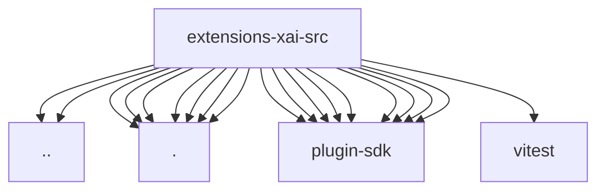

# Imports

[← Back to MODULE](MODULE.md) | [← Back to INDEX](../../INDEX.md)

## Dependency Graph

## External Dependencies

Dependencies from other modules:

- `../model-definitions.js`
- `../model-id.js`
- `./responses-tool-shared.js`
- `./tool-auth-shared.js`
- `./tool-config-shared.js`
- `./web-search-shared.js`
- `./x-search-config.js`
- `./x-search-shared.js`
- `./xai-user-agent.js`
- `openclaw/plugin-sdk/agent-harness-runtime`
- `openclaw/plugin-sdk/agent-runtime`
- `openclaw/plugin-sdk/extension-shared`
- `openclaw/plugin-sdk/provider-auth`
- `openclaw/plugin-sdk/provider-auth-runtime`
- `openclaw/plugin-sdk/provider-http`
- `openclaw/plugin-sdk/provider-web-search`
- `openclaw/plugin-sdk/secret-input`
- `openclaw/plugin-sdk/string-coerce-runtime`
- `vitest`
