# Imports

[← Back to MODULE](MODULE.md) | [← Back to INDEX](../../INDEX.md)

## Dependency Graph

```mermaid
graph TD
    extensions_xai[extensions-xai] --> _[.]
    extensions_xai[extensions-xai] --> _[.]
    extensions_xai[extensions-xai] --> _[.]
    extensions_xai[extensions-xai] --> _[.]
    extensions_xai[extensions-xai] --> _[.]
    extensions_xai[extensions-xai] --> _[.]
    extensions_xai[extensions-xai] --> _[.]
    extensions_xai[extensions-xai] --> _[.]
    extensions_xai[extensions-xai] --> _[.]
    extensions_xai[extensions-xai] --> _[.]
    extensions_xai[extensions-xai] --> _[.]
    extensions_xai[extensions-xai] --> _[.]
    extensions_xai[extensions-xai] --> _[.]
    extensions_xai[extensions-xai] --> _[.]
    extensions_xai[extensions-xai] --> _[.]
    extensions_xai[extensions-xai] --> _[.]
    extensions_xai[extensions-xai] --> _[.]
    extensions_xai[extensions-xai] --> _[.]
    extensions_xai[extensions-xai] --> _[.]
    extensions_xai[extensions-xai] --> _[.]
    extensions_xai[extensions-xai] --> _[.]
    extensions_xai[extensions-xai] --> _[.]
    extensions_xai[extensions-xai] --> _[.]
    extensions_xai[extensions-xai] --> _[.]
    extensions_xai[extensions-xai] --> src[src]
    extensions_xai[extensions-xai] --> src[src]
    extensions_xai[extensions-xai] --> src[src]
    extensions_xai[extensions-xai] --> src[src]
    extensions_xai[extensions-xai] --> src[src]
    extensions_xai[extensions-xai] --> src[src]
    extensions_xai[extensions-xai] --> src[src]
    extensions_xai[extensions-xai] --> src[src]
    extensions_xai[extensions-xai] --> _[.]
    extensions_xai[extensions-xai] --> _[.]
    extensions_xai[extensions-xai] --> _[.]
    extensions_xai[extensions-xai] --> _[.]
    extensions_xai[extensions-xai] --> _[.]
    extensions_xai[extensions-xai] --> _[.]
    extensions_xai[extensions-xai] --> _[.]
    extensions_xai[extensions-xai] --> _[.]
    extensions_xai[extensions-xai] --> _[.]
    extensions_xai[extensions-xai] --> _[.]
    extensions_xai[extensions-xai] --> _[.]
    extensions_xai[extensions-xai] --> _[.]
    extensions_xai[extensions-xai] --> _[.]
    extensions_xai[extensions-xai] --> node_crypto[node:crypto]
    extensions_xai[extensions-xai] --> node_fs[node:fs]
    extensions_xai[extensions-xai] --> node_fs[node:fs]
    extensions_xai[extensions-xai] --> node_http[node:http]
    extensions_xai[extensions-xai] --> node_os[node:os]
    extensions_xai[extensions-xai] --> node_path[node:path]
    extensions_xai[extensions-xai] --> plugin_sdk[plugin-sdk]
    extensions_xai[extensions-xai] --> plugin_sdk[plugin-sdk]
    extensions_xai[extensions-xai] --> plugin_sdk[plugin-sdk]
    extensions_xai[extensions-xai] --> plugin_sdk[plugin-sdk]
    extensions_xai[extensions-xai] --> plugin_sdk[plugin-sdk]
    extensions_xai[extensions-xai] --> plugin_sdk[plugin-sdk]
    extensions_xai[extensions-xai] --> plugin_sdk[plugin-sdk]
    extensions_xai[extensions-xai] --> plugin_sdk[plugin-sdk]
    extensions_xai[extensions-xai] --> plugin_sdk[plugin-sdk]
    extensions_xai[extensions-xai] --> plugin_sdk[plugin-sdk]
    extensions_xai[extensions-xai] --> plugin_sdk[plugin-sdk]
    extensions_xai[extensions-xai] --> plugin_sdk[plugin-sdk]
    extensions_xai[extensions-xai] --> plugin_sdk[plugin-sdk]
    extensions_xai[extensions-xai] --> plugin_sdk[plugin-sdk]
    extensions_xai[extensions-xai] --> plugin_sdk[plugin-sdk]
    extensions_xai[extensions-xai] --> plugin_sdk[plugin-sdk]
    extensions_xai[extensions-xai] --> plugin_sdk[plugin-sdk]
    extensions_xai[extensions-xai] --> plugin_sdk[plugin-sdk]
    extensions_xai[extensions-xai] --> plugin_sdk[plugin-sdk]
    extensions_xai[extensions-xai] --> plugin_sdk[plugin-sdk]
    extensions_xai[extensions-xai] --> plugin_sdk[plugin-sdk]
    extensions_xai[extensions-xai] --> plugin_sdk[plugin-sdk]
    extensions_xai[extensions-xai] --> plugin_sdk[plugin-sdk]
    extensions_xai[extensions-xai] --> plugin_sdk[plugin-sdk]
    extensions_xai[extensions-xai] --> plugin_sdk[plugin-sdk]
    extensions_xai[extensions-xai] --> plugin_sdk[plugin-sdk]
    extensions_xai[extensions-xai] --> plugin_sdk[plugin-sdk]
    extensions_xai[extensions-xai] --> plugin_sdk[plugin-sdk]
    extensions_xai[extensions-xai] --> plugin_sdk[plugin-sdk]
    extensions_xai[extensions-xai] --> plugin_sdk[plugin-sdk]
    extensions_xai[extensions-xai] --> plugin_sdk[plugin-sdk]
    extensions_xai[extensions-xai] --> plugin_sdk[plugin-sdk]
    extensions_xai[extensions-xai] --> plugin_sdk[plugin-sdk]
    extensions_xai[extensions-xai] --> plugin_sdk[plugin-sdk]
    extensions_xai[extensions-xai] --> plugin_sdk[plugin-sdk]
    extensions_xai[extensions-xai] --> typebox[typebox]
    extensions_xai[extensions-xai] --> vitest[vitest]
    extensions_xai[extensions-xai] --> ws[ws]
```

## External Dependencies

Dependencies from other modules:

- `./api.js`
- `./code-execution-tool-shared.js`
- `./code-execution.js`
- `./doctor-contract-api.js`
- `./image-generation-provider.js`
- `./index.js`
- `./model-compat.js`
- `./model-definitions.js`
- `./model-id.js`
- `./onboard.js`
- `./openclaw.plugin.json`
- `./provider-catalog.js`
- `./provider-id.js`
- `./provider-models.js`
- `./provider-policy-api.js`
- `./realtime-transcription-provider.js`
- `./realtime-voice-bridge.js`
- `./realtime-voice-config.js`
- `./realtime-voice-events.js`
- `./realtime-voice-protocol.js`
- `./realtime-voice-provider.js`
- `./runtime-model-compat.js`
- `./setup-api.js`
- `./speech-provider.js`
- `./src/code-execution-config.js`
- `./src/code-execution-shared.js`
- `./src/tool-auth-shared.js`
- `./src/tool-config-shared.js`
- `./src/web-search-shared.js`
- `./src/x-search-config.js`
- `./src/x-search-shared.js`
- `./src/xai-user-agent.js`
- `./stream.js`
- `./stt.js`
- `./test-api.js`
- `./test-helpers.js`
- `./tts.js`
- `./video-generation-provider.js`
- `./video-generation-transport.js`
- `./web-search-contract-api.js`
- `./web-search-provider-shared.js`
- `./web-search.js`
- `./x-search-tool-shared.js`
- `./x-search.js`
- `./xai-oauth.js`
- `node:crypto`
- `node:fs`
- `node:fs/promises`
- `node:http`
- `node:os`
- `node:path`
- `openclaw/plugin-sdk/error-runtime`
- `openclaw/plugin-sdk/image-generation`
- `openclaw/plugin-sdk/lazy-runtime`
- `openclaw/plugin-sdk/llm`
- `openclaw/plugin-sdk/media-mime`
- `openclaw/plugin-sdk/media-runtime`
- `openclaw/plugin-sdk/number-runtime`
- `openclaw/plugin-sdk/plugin-entry`
- `openclaw/plugin-sdk/plugin-test-api`
- `openclaw/plugin-sdk/plugin-test-runtime`
- `openclaw/plugin-sdk/provider-auth`
- `openclaw/plugin-sdk/provider-auth-runtime`
- `openclaw/plugin-sdk/provider-catalog-live-runtime`
- `openclaw/plugin-sdk/provider-entry`
- `openclaw/plugin-sdk/provider-http`
- `openclaw/plugin-sdk/provider-http-test-mocks`
- `openclaw/plugin-sdk/provider-model-shared`
- `openclaw/plugin-sdk/provider-onboard`
- `openclaw/plugin-sdk/provider-stream-shared`
- `openclaw/plugin-sdk/provider-test-contracts`
- `openclaw/plugin-sdk/provider-web-search`
- `openclaw/plugin-sdk/provider-web-search-config-contract`
- `openclaw/plugin-sdk/proxy-capture`
- `openclaw/plugin-sdk/realtime-transcription`
- `openclaw/plugin-sdk/realtime-voice`
- `openclaw/plugin-sdk/response-limit-runtime`
- `openclaw/plugin-sdk/runtime-config-snapshot`
- `openclaw/plugin-sdk/runtime-env`
- `openclaw/plugin-sdk/secret-input`
- `openclaw/plugin-sdk/speech`
- `openclaw/plugin-sdk/speech-core`
- `openclaw/plugin-sdk/ssrf-runtime`
- `openclaw/plugin-sdk/string-coerce-runtime`
- `openclaw/plugin-sdk/test-env`
- `openclaw/plugin-sdk/test-live`
- `typebox`
- `vitest`
- `ws`
