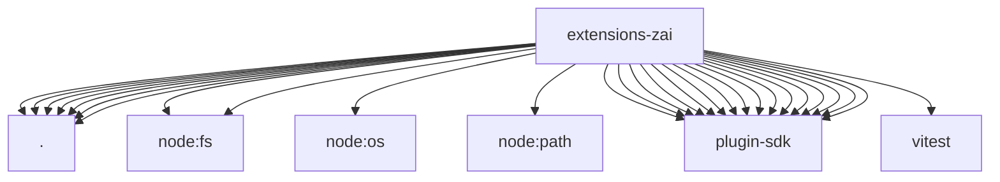

# Imports

[← Back to MODULE](MODULE.md) | [← Back to INDEX](../../INDEX.md)

## Dependency Graph

## External Dependencies

Dependencies from other modules:

- `./detect.js`
- `./index.js`
- `./media-understanding-provider.js`
- `./model-definitions.js`
- `./onboard.js`
- `./openclaw.plugin.json`
- `./provider-policy-api.js`
- `node:fs`
- `node:fs/promises`
- `node:os`
- `node:path`
- `openclaw/plugin-sdk/agent-sessions`
- `openclaw/plugin-sdk/media-understanding`
- `openclaw/plugin-sdk/number-runtime`
- `openclaw/plugin-sdk/plugin-entry`
- `openclaw/plugin-sdk/plugin-test-runtime`
- `openclaw/plugin-sdk/provider-auth-api-key`
- `openclaw/plugin-sdk/provider-catalog-shared`
- `openclaw/plugin-sdk/provider-http`
- `openclaw/plugin-sdk/provider-model-shared`
- `openclaw/plugin-sdk/provider-onboard`
- `openclaw/plugin-sdk/provider-stream-shared`
- `openclaw/plugin-sdk/provider-test-contracts`
- `openclaw/plugin-sdk/provider-transport-runtime`
- `openclaw/plugin-sdk/provider-usage`
- `openclaw/plugin-sdk/response-limit-runtime`
- `openclaw/plugin-sdk/string-coerce-runtime`
- `vitest`
