# Imports

[← Back to MODULE](MODULE.md) | [← Back to INDEX](../../INDEX.md)

## Dependency Graph

```mermaid
graph TD
    extensions_zalouser_src[extensions-zalouser-src] --> _[.]
    extensions_zalouser_src[extensions-zalouser-src] --> _[.]
    extensions_zalouser_src[extensions-zalouser-src] --> _[.]
    extensions_zalouser_src[extensions-zalouser-src] --> _[.]
    extensions_zalouser_src[extensions-zalouser-src] --> _[.]
    extensions_zalouser_src[extensions-zalouser-src] --> _[.]
    extensions_zalouser_src[extensions-zalouser-src] --> _[.]
    extensions_zalouser_src[extensions-zalouser-src] --> _[.]
    extensions_zalouser_src[extensions-zalouser-src] --> _[.]
    extensions_zalouser_src[extensions-zalouser-src] --> _[.]
    extensions_zalouser_src[extensions-zalouser-src] --> _[.]
    extensions_zalouser_src[extensions-zalouser-src] --> _[.]
    extensions_zalouser_src[extensions-zalouser-src] --> _[.]
    extensions_zalouser_src[extensions-zalouser-src] --> _[.]
    extensions_zalouser_src[extensions-zalouser-src] --> _[.]
    extensions_zalouser_src[extensions-zalouser-src] --> _[.]
    extensions_zalouser_src[extensions-zalouser-src] --> _[.]
    extensions_zalouser_src[extensions-zalouser-src] --> _[.]
    extensions_zalouser_src[extensions-zalouser-src] --> _[.]
    extensions_zalouser_src[extensions-zalouser-src] --> _[.]
    extensions_zalouser_src[extensions-zalouser-src] --> _[.]
    extensions_zalouser_src[extensions-zalouser-src] --> _[.]
    extensions_zalouser_src[extensions-zalouser-src] --> _[.]
    extensions_zalouser_src[extensions-zalouser-src] --> _[.]
    extensions_zalouser_src[extensions-zalouser-src] --> _[.]
    extensions_zalouser_src[extensions-zalouser-src] --> _[.]
    extensions_zalouser_src[extensions-zalouser-src] --> _[.]
    extensions_zalouser_src[extensions-zalouser-src] --> _[.]
    extensions_zalouser_src[extensions-zalouser-src] --> _[.]
    extensions_zalouser_src[extensions-zalouser-src] --> _[.]
    extensions_zalouser_src[extensions-zalouser-src] --> _[.]
    extensions_zalouser_src[extensions-zalouser-src] --> _[.]
    extensions_zalouser_src[extensions-zalouser-src] --> _[.]
    extensions_zalouser_src[extensions-zalouser-src] --> _[.]
    extensions_zalouser_src[extensions-zalouser-src] --> _[.]
    extensions_zalouser_src[extensions-zalouser-src] --> _[.]
    extensions_zalouser_src[extensions-zalouser-src] --> _[.]
    extensions_zalouser_src[extensions-zalouser-src] --> node_crypto[node:crypto]
    extensions_zalouser_src[extensions-zalouser-src] --> node_fs[node:fs]
    extensions_zalouser_src[extensions-zalouser-src] --> node_os[node:os]
    extensions_zalouser_src[extensions-zalouser-src] --> node_path[node:path]
    extensions_zalouser_src[extensions-zalouser-src] --> plugin_sdk[plugin-sdk]
    extensions_zalouser_src[extensions-zalouser-src] --> plugin_sdk[plugin-sdk]
    extensions_zalouser_src[extensions-zalouser-src] --> plugin_sdk[plugin-sdk]
    extensions_zalouser_src[extensions-zalouser-src] --> plugin_sdk[plugin-sdk]
    extensions_zalouser_src[extensions-zalouser-src] --> plugin_sdk[plugin-sdk]
    extensions_zalouser_src[extensions-zalouser-src] --> plugin_sdk[plugin-sdk]
    extensions_zalouser_src[extensions-zalouser-src] --> plugin_sdk[plugin-sdk]
    extensions_zalouser_src[extensions-zalouser-src] --> plugin_sdk[plugin-sdk]
    extensions_zalouser_src[extensions-zalouser-src] --> plugin_sdk[plugin-sdk]
    extensions_zalouser_src[extensions-zalouser-src] --> plugin_sdk[plugin-sdk]
    extensions_zalouser_src[extensions-zalouser-src] --> plugin_sdk[plugin-sdk]
    extensions_zalouser_src[extensions-zalouser-src] --> plugin_sdk[plugin-sdk]
    extensions_zalouser_src[extensions-zalouser-src] --> plugin_sdk[plugin-sdk]
    extensions_zalouser_src[extensions-zalouser-src] --> plugin_sdk[plugin-sdk]
    extensions_zalouser_src[extensions-zalouser-src] --> plugin_sdk[plugin-sdk]
    extensions_zalouser_src[extensions-zalouser-src] --> plugin_sdk[plugin-sdk]
    extensions_zalouser_src[extensions-zalouser-src] --> plugin_sdk[plugin-sdk]
    extensions_zalouser_src[extensions-zalouser-src] --> plugin_sdk[plugin-sdk]
    extensions_zalouser_src[extensions-zalouser-src] --> plugin_sdk[plugin-sdk]
    extensions_zalouser_src[extensions-zalouser-src] --> plugin_sdk[plugin-sdk]
    extensions_zalouser_src[extensions-zalouser-src] --> plugin_sdk[plugin-sdk]
    extensions_zalouser_src[extensions-zalouser-src] --> plugin_sdk[plugin-sdk]
    extensions_zalouser_src[extensions-zalouser-src] --> plugin_sdk[plugin-sdk]
    extensions_zalouser_src[extensions-zalouser-src] --> plugin_sdk[plugin-sdk]
    extensions_zalouser_src[extensions-zalouser-src] --> plugin_sdk[plugin-sdk]
    extensions_zalouser_src[extensions-zalouser-src] --> plugin_sdk[plugin-sdk]
    extensions_zalouser_src[extensions-zalouser-src] --> plugin_sdk[plugin-sdk]
    extensions_zalouser_src[extensions-zalouser-src] --> plugin_sdk[plugin-sdk]
    extensions_zalouser_src[extensions-zalouser-src] --> plugin_sdk[plugin-sdk]
    extensions_zalouser_src[extensions-zalouser-src] --> plugin_sdk[plugin-sdk]
    extensions_zalouser_src[extensions-zalouser-src] --> plugin_sdk[plugin-sdk]
    extensions_zalouser_src[extensions-zalouser-src] --> plugin_sdk[plugin-sdk]
    extensions_zalouser_src[extensions-zalouser-src] --> plugin_sdk[plugin-sdk]
    extensions_zalouser_src[extensions-zalouser-src] --> plugin_sdk[plugin-sdk]
    extensions_zalouser_src[extensions-zalouser-src] --> plugin_sdk[plugin-sdk]
    extensions_zalouser_src[extensions-zalouser-src] --> plugin_sdk[plugin-sdk]
    extensions_zalouser_src[extensions-zalouser-src] --> plugin_sdk[plugin-sdk]
    extensions_zalouser_src[extensions-zalouser-src] --> plugin_sdk[plugin-sdk]
    extensions_zalouser_src[extensions-zalouser-src] --> plugin_sdk[plugin-sdk]
    extensions_zalouser_src[extensions-zalouser-src] --> plugin_sdk[plugin-sdk]
    extensions_zalouser_src[extensions-zalouser-src] --> plugin_sdk[plugin-sdk]
    extensions_zalouser_src[extensions-zalouser-src] --> plugin_sdk[plugin-sdk]
    extensions_zalouser_src[extensions-zalouser-src] --> plugin_sdk[plugin-sdk]
    extensions_zalouser_src[extensions-zalouser-src] --> typebox[typebox]
    extensions_zalouser_src[extensions-zalouser-src] --> vitest[vitest]
    extensions_zalouser_src[extensions-zalouser-src] --> zod[zod]
```

## External Dependencies

Dependencies from other modules:

- `./accounts.js`
- `./accounts.test-mocks.js`
- `./channel-api.js`
- `./channel.adapters.js`
- `./channel.js`
- `./config-schema.js`
- `./directory.js`
- `./doctor-contract.js`
- `./doctor.js`
- `./group-policy.js`
- `./ingress.js`
- `./ingress.test-support.js`
- `./message-sid.js`
- `./monitor.js`
- `./monitor.send.test-mocks.js`
- `./probe.js`
- `./qr-temp-file.js`
- `./reaction.js`
- `./runtime.js`
- `./security-audit.js`
- `./send-receipt.js`
- `./send.js`
- `./session-route.js`
- `./session-scope.js`
- `./session-state.js`
- `./setup-core.js`
- `./setup-surface.js`
- `./setup-test-helpers.js`
- `./shared.js`
- `./status-issues.js`
- `./test-helpers.js`
- `./text-styles.js`
- `./tool.js`
- `./zalo-js.js`
- `./zalo-js.test-mocks.js`
- `./zca-client.js`
- `./zca-constants.js`
- `node:crypto`
- `node:fs/promises`
- `node:os`
- `node:path`
- `openclaw/plugin-sdk/account-helpers`
- `openclaw/plugin-sdk/account-id`
- `openclaw/plugin-sdk/account-resolution`
- `openclaw/plugin-sdk/allow-from`
- `openclaw/plugin-sdk/channel-actions`
- `openclaw/plugin-sdk/channel-config-helpers`
- `openclaw/plugin-sdk/channel-config-schema`
- `openclaw/plugin-sdk/channel-contract-testing`
- `openclaw/plugin-sdk/channel-core`
- `openclaw/plugin-sdk/channel-inbound`
- `openclaw/plugin-sdk/channel-ingress-runtime`
- `openclaw/plugin-sdk/channel-outbound`
- `openclaw/plugin-sdk/channel-pairing`
- `openclaw/plugin-sdk/channel-policy`
- `openclaw/plugin-sdk/channel-send-result`
- `openclaw/plugin-sdk/channel-test-helpers`
- `openclaw/plugin-sdk/conversation-runtime`
- `openclaw/plugin-sdk/core`
- `openclaw/plugin-sdk/dangerous-name-runtime`
- `openclaw/plugin-sdk/error-runtime`
- `openclaw/plugin-sdk/expect-runtime`
- `openclaw/plugin-sdk/extension-shared`
- `openclaw/plugin-sdk/lazy-runtime`
- `openclaw/plugin-sdk/media-mime`
- `openclaw/plugin-sdk/number-runtime`
- `openclaw/plugin-sdk/outbound-media`
- `openclaw/plugin-sdk/plugin-state-test-runtime`
- `openclaw/plugin-sdk/plugin-test-runtime`
- `openclaw/plugin-sdk/reply-history`
- `openclaw/plugin-sdk/reply-payload`
- `openclaw/plugin-sdk/runtime-group-policy`
- `openclaw/plugin-sdk/runtime-store`
- `openclaw/plugin-sdk/security-runtime`
- `openclaw/plugin-sdk/setup`
- `openclaw/plugin-sdk/setup-runtime`
- `openclaw/plugin-sdk/state-paths`
- `openclaw/plugin-sdk/status-helpers`
- `openclaw/plugin-sdk/string-coerce-runtime`
- `openclaw/plugin-sdk/temp-path`
- `openclaw/plugin-sdk/test-env`
- `openclaw/plugin-sdk/text-chunking`
- `openclaw/plugin-sdk/text-utility-runtime`
- `openclaw/plugin-sdk/tool-results`
- `typebox`
- `vitest`
- `zod`
