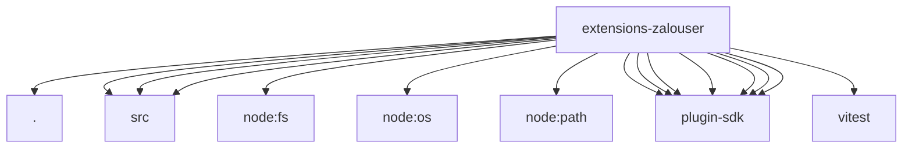

# Imports

[← Back to MODULE](MODULE.md) | [← Back to INDEX](../../INDEX.md)

## Dependency Graph

## External Dependencies

Dependencies from other modules:

- `./doctor-contract-api.js`
- `./src/runtime.js`
- `./src/session-scope.js`
- `./src/session-state.js`
- `node:fs/promises`
- `node:os`
- `node:path`
- `openclaw/plugin-sdk/channel-entry-contract`
- `openclaw/plugin-sdk/plugin-state-test-runtime`
- `openclaw/plugin-sdk/plugin-test-runtime`
- `openclaw/plugin-sdk/routing`
- `openclaw/plugin-sdk/runtime-doctor`
- `openclaw/plugin-sdk/session-store-runtime`
- `openclaw/plugin-sdk/string-coerce-runtime`
- `vitest`
