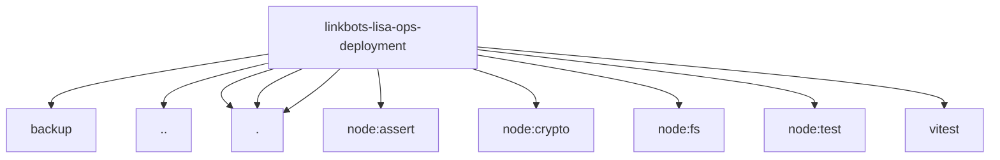

# Imports

[← Back to MODULE](MODULE.md) | [← Back to INDEX](../../INDEX.md)

## Dependency Graph

## External Dependencies

Dependencies from other modules:

- `../backup/backup.ts`
- `../lisa-vps-reconciliation.mjs`
- `./deployment.js`
- `./deployment.ts`
- `./pkt11-source-base-preflight.mjs`
- `node:assert/strict`
- `node:crypto`
- `node:fs`
- `node:test`
- `vitest`
