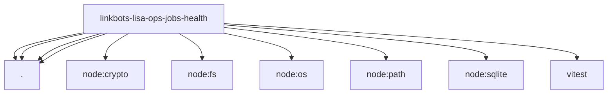

# Imports

[← Back to MODULE](MODULE.md) | [← Back to INDEX](../../INDEX.md)

## Dependency Graph

## External Dependencies

Dependencies from other modules:

- `./health-contracts.js`
- `./health-schema.js`
- `./health-store.js`
- `./health.js`
- `node:crypto`
- `node:fs`
- `node:os`
- `node:path`
- `node:sqlite`
- `vitest`
