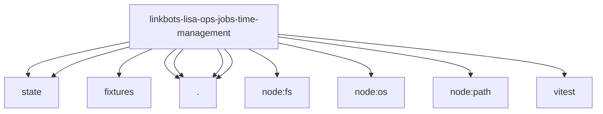

# Imports

[← Back to MODULE](MODULE.md) | [← Back to INDEX](../../INDEX.md)

## Dependency Graph

## External Dependencies

Dependencies from other modules:

- `../../../../../src/state/lisa-principal-task-store.js`
- `../../../../../src/state/openclaw-agent-db.js`
- `./fixtures/golden-scenarios.json`
- `./intake.js`
- `./planner.js`
- `./principal-task.js`
- `./time-contracts.js`
- `node:fs`
- `node:os`
- `node:path`
- `vitest`
