# Imports

[← Back to MODULE](MODULE.md) | [← Back to INDEX](../../INDEX.md)

## Dependency Graph

```mermaid
graph TD
    linkbots_lisa_ops_jobs[linkbots-lisa-ops-jobs] --> providers[providers]
    linkbots_lisa_ops_jobs[linkbots-lisa-ops-jobs] --> __[..]
    linkbots_lisa_ops_jobs[linkbots-lisa-ops-jobs] --> __[..]
    linkbots_lisa_ops_jobs[linkbots-lisa-ops-jobs] --> compliance[compliance]
    linkbots_lisa_ops_jobs[linkbots-lisa-ops-jobs] --> compliance[compliance]
    linkbots_lisa_ops_jobs[linkbots-lisa-ops-jobs] --> health[health]
    linkbots_lisa_ops_jobs[linkbots-lisa-ops-jobs] --> _[.]
    linkbots_lisa_ops_jobs[linkbots-lisa-ops-jobs] --> _[.]
    linkbots_lisa_ops_jobs[linkbots-lisa-ops-jobs] --> _[.]
    linkbots_lisa_ops_jobs[linkbots-lisa-ops-jobs] --> _[.]
    linkbots_lisa_ops_jobs[linkbots-lisa-ops-jobs] --> _[.]
    linkbots_lisa_ops_jobs[linkbots-lisa-ops-jobs] --> _[.]
    linkbots_lisa_ops_jobs[linkbots-lisa-ops-jobs] --> _[.]
    linkbots_lisa_ops_jobs[linkbots-lisa-ops-jobs] --> maintenance[maintenance]
    linkbots_lisa_ops_jobs[linkbots-lisa-ops-jobs] --> maintenance[maintenance]
    linkbots_lisa_ops_jobs[linkbots-lisa-ops-jobs] --> _[.]
    linkbots_lisa_ops_jobs[linkbots-lisa-ops-jobs] --> reporting[reporting]
    linkbots_lisa_ops_jobs[linkbots-lisa-ops-jobs] --> time_management[time-management]
    linkbots_lisa_ops_jobs[linkbots-lisa-ops-jobs] --> node_crypto[node:crypto]
    linkbots_lisa_ops_jobs[linkbots-lisa-ops-jobs] --> node_fs[node:fs]
    linkbots_lisa_ops_jobs[linkbots-lisa-ops-jobs] --> node_os[node:os]
    linkbots_lisa_ops_jobs[linkbots-lisa-ops-jobs] --> node_path[node:path]
    linkbots_lisa_ops_jobs[linkbots-lisa-ops-jobs] --> node_process[node:process]
    linkbots_lisa_ops_jobs[linkbots-lisa-ops-jobs] --> node_sqlite[node:sqlite]
    linkbots_lisa_ops_jobs[linkbots-lisa-ops-jobs] --> node_url[node:url]
    linkbots_lisa_ops_jobs[linkbots-lisa-ops-jobs] --> vitest[vitest]
```

## External Dependencies

Dependencies from other modules:

- `../providers/pin-identities.ts`
- `../stage-ops-cron-installer.ts`
- `../templates.ts`
- `./compliance/battery.ts`
- `./compliance/selfie.ts`
- `./health/health-contracts.ts`
- `./lisa-job-catalogue.ts`
- `./lisa-job-contracts.js`
- `./lisa-job-contracts.ts`
- `./lisa-job-desired-state.ts`
- `./lisa-live-digest-contract.mjs`
- `./lisa-live-job-ownership.mjs`
- `./lisa-live-message-contract.mjs`
- `./maintenance/maintenance-contracts.ts`
- `./maintenance/maintenance.ts`
- `./render-lisa-job-template.ts`
- `./reporting/reporting.ts`
- `./time-management/planner.ts`
- `node:crypto`
- `node:fs`
- `node:os`
- `node:path`
- `node:process`
- `node:sqlite`
- `node:url`
- `vitest`
