# Imports

[← Back to MODULE](MODULE.md) | [← Back to INDEX](../../INDEX.md)

## Dependency Graph

```mermaid
graph TD
    linkbots_lisa_ops_providers[linkbots-lisa-ops-providers] --> linkautowork[linkautowork]
    linkbots_lisa_ops_providers[linkbots-lisa-ops-providers] --> linkbrain[linkbrain]
    linkbots_lisa_ops_providers[linkbots-lisa-ops-providers] --> linklibraries[linklibraries]
    linkbots_lisa_ops_providers[linkbots-lisa-ops-providers] --> linkplatform[linkplatform]
    linkbots_lisa_ops_providers[linkbots-lisa-ops-providers] --> linkskills[linkskills]
    linkbots_lisa_ops_providers[linkbots-lisa-ops-providers] --> jobs[jobs]
    linkbots_lisa_ops_providers[linkbots-lisa-ops-providers] --> time_management[time-management]
    linkbots_lisa_ops_providers[linkbots-lisa-ops-providers] --> time_management[time-management]
    linkbots_lisa_ops_providers[linkbots-lisa-ops-providers] --> __[..]
    linkbots_lisa_ops_providers[linkbots-lisa-ops-providers] --> _[.]
    linkbots_lisa_ops_providers[linkbots-lisa-ops-providers] --> _[.]
    linkbots_lisa_ops_providers[linkbots-lisa-ops-providers] --> _[.]
    linkbots_lisa_ops_providers[linkbots-lisa-ops-providers] --> _[.]
    linkbots_lisa_ops_providers[linkbots-lisa-ops-providers] --> _[.]
    linkbots_lisa_ops_providers[linkbots-lisa-ops-providers] --> _[.]
    linkbots_lisa_ops_providers[linkbots-lisa-ops-providers] --> _[.]
    linkbots_lisa_ops_providers[linkbots-lisa-ops-providers] --> _[.]
    linkbots_lisa_ops_providers[linkbots-lisa-ops-providers] --> _[.]
    linkbots_lisa_ops_providers[linkbots-lisa-ops-providers] --> _[.]
    linkbots_lisa_ops_providers[linkbots-lisa-ops-providers] --> _[.]
    linkbots_lisa_ops_providers[linkbots-lisa-ops-providers] --> _[.]
    linkbots_lisa_ops_providers[linkbots-lisa-ops-providers] --> _[.]
    linkbots_lisa_ops_providers[linkbots-lisa-ops-providers] --> node_crypto[node:crypto]
    linkbots_lisa_ops_providers[linkbots-lisa-ops-providers] --> node_fs[node:fs]
    linkbots_lisa_ops_providers[linkbots-lisa-ops-providers] --> node_path[node:path]
    linkbots_lisa_ops_providers[linkbots-lisa-ops-providers] --> node_url[node:url]
    linkbots_lisa_ops_providers[linkbots-lisa-ops-providers] --> vitest[vitest]
```

## External Dependencies

Dependencies from other modules:

- `../../../../extensions/linkautowork/api.js`
- `../../../../extensions/linkbrain/api.js`
- `../../../../extensions/linklibraries/api.js`
- `../../../../extensions/linkplatform/api.js`
- `../../../../extensions/linkskills/api.js`
- `../jobs/lisa-job-catalogue.js`
- `../jobs/time-management/intake.js`
- `../jobs/time-management/planner.js`
- `../ship-pull-contract.js`
- `./autowork.js`
- `./capabilities.js`
- `./fakes.js`
- `./identity.js`
- `./libraries.js`
- `./outcomes.js`
- `./own-data.js`
- `./pin-identities.js`
- `./policy.js`
- `./ports.js`
- `./privacy.js`
- `./skills.js`
- `./wiring.js`
- `node:crypto`
- `node:fs`
- `node:path`
- `node:url`
- `vitest`
